<a name="toc"></a>
# Climpact user guide

Visit the Climpact [website](https://climpact-sci.org/) and [Github repository](https://github.com/ARCCSS-extremes/climpact) to find out more about the Climpact project.

## Table of contents

1. [Acknowledgements](#acknowledgements)
1. [Background to Climpact](#background)
1. [Getting and installing Climpact locally](#gettinginstalling)
1. [Calculating the indices from a single station text file](#calculatesingle)
1. [Calculating the indices from multiple station text files](#calculatebatch)
1. [Output for station text files](#outputstation)
1. [Calculating the indices from netCDF files](#calculatenetcdf)
1. [Output for netCDF files](#outputgridded)

[Appendix A: Table of indices](#appendixa)
<br>
[Appendix B: Format of input files](#appendixb)
<br>
[Appendix C: Percentile threshold calculations](#appendixc)
<br>
[Appendix D: Heatwave and coldwave calculations](#appendixd)
<br>
[Appendix E: FAQ](#appendixe)
<br>
[Appendix F: Software license agreement](../../LICENSE)


<a name="acknowledgements"></a>
## 1. Acknowledgements
[RETURN TO TOP](#toc)

* Climpact was made possible by the WMO Commission for Climatology (CCl) Open Panel of Experts on Climate Information for Adaptation and Risk Management (OPACE 4) under the guidance of OPACE-4 co-chairs (Rodney Martinez and Andrew Tait); the CCl OPACE 4 Expert Team on Sector-specific Climate Indices (ET-SCI) phase one members: Lisa Alexander (Chair, Australia), Toshiyuki Nakaegawa (co-Chair, Japan), Fatima Zohra El Guelai (Morocco), Amelia Diaz Pablo (Peru), Adam Kalkstein (USA) and Gé Verver (The Netherlands), and the WMO World Climate Applications and Services Programme (Rupa Kumar Kolli and Anahit Hovsepyan). 

* Climpact and its associated material draws heavily on the input of the Expert Team on Climate Risk and Sector-specific Climate Indices (ET-CRSCI), the ET-SCI that succeeded it and including additional ET-CRSCI members Elena Akentyeva, Alexis Nimubona, G. Srinivasan, Philip Thornton and Peiqun Zhang. Significant contributions to the development of the Climpact indices, software and documentation also came from Jonathan McComb, Nicholas Herold, Nicholas Hannah, Enric Aguilar, Andrew King, James Goldie, Brad Rippey, Sarah Perkins, Sergio M. Vicente-Serrano, Juan Jose Nieto, Sandra Schuster and Hongang Yang. Input was also provided by James Hiebert of PCIC. We are also grateful to the other experts and sector representatives who have contributed to the development of indices: Manola Brunet, Albert Klein Tank, Christina Koppe, Sari Kovats, Glenn McGregor, Xuebin Zhang, Javier Sigro, Peter Domonkos, Dimitrios Efthymiadis.

* Climpact is written in the R programming language and makes use of numerous third party R packages. R is available as Free Software under the terms of the Free Software Foundation's GNU General Public License in source code form. Climpact uses the R packages [climdex.pcic](https://pacificclimate.github.io/climdex.pcic/) and [climdex.pcic.ncdf](https://pacificclimate.github.io/climdex.pcic.ncdf/) as its core for calculating indices. These packages are developed by the Pacific Climate Impacts Consortium (PCIC) and are used in a modified form here to calculate additional indices.

* The application of climate indices to the Agriculture sector was undertaken in full cooperation with the WMO Commission for Agricultural Meteorology, through which Brad Rippey and Sergio Vicente Serrano supported the work.

* Commission for Climatology experts Glenn McGregor, Christina Koppe and Sari Kovats supported the application of indices for Climate and Health, in particular for heat waves and health.

* This work has also been historically supported by WMO grant SSA 3876-12/REM/CNS and Australian Research Council grants CE110001028... and through funding from the New South Wales Office of the Environment and Heritage. 

<a name="background"></a>
## 2. Background to the ET-SCI
[RETURN TO TOP](#toc)

This document was prepared on behalf of the World Meteorological Organization (WMO) Commission for Climatology (CCl) Expert Team on Sector-specific Climate Indices (ET-SCI). It outlines the background and goals of the ET-SCI and describes the Climpact software and indices that were developed on their behalf.

The ET-SCI, formerly known as the Expert Team on Climate Risk and Sector-specific Indices (ET-CRSCI) was set up by the Fifteenth session of the WMO Technical Commission for Climatology (CCl-XV, Antalya, Turkey, February 2010), with terms of reference established to support eventual implementation of the Global Framework for Climate Services (GFCS). Following the sixteenth World Meteorological Congress in May 2011 where a decision was made by WMO members to implement the GFCS, the ET-SCI held their first meeting in Tarragona, Spain (13-15 July, 2011).

### 2.1 Role of ET-SCI in GFCS

The ET-SCI sits within the CCl under the Open Panel of CCl Experts (OPACE) on Climate Information for Adaptation and Risk Management (OPACE-4). The objective of OPACE-4 is to improve decision-making for planning, operations, risk management and for adaptation to both climate change and variability (covering time scales from seasonal to centennial) and will be achieved through a higher level of climate knowledge, as well as by access to and use of actionable information and products, tailored to meet their needs. OPACE-4 activities primarily focus on the development of tailored climate information, products and services for user application in adaptation and risk management, and building interfaces with user groups to facilitate GFCS implementation.

The work of OPACE-4 is multidisciplinary, and requires close collaboration with experts from various socio-economic sectors. In keeping with the priorities agreed for initial implementation of the GFCS, the core priority sectors for consideration by the OPACE in this present intersessional period are agriculture/food security, water and health. This requires close collaboration with relevant experts in these sectors including seeking guidance and aid from the WMO Technical Commissions for Agricultural Meteorology (CAgM) and Hydrology (CHy) and with the World Health Organisation (WHO).

The ET-SCI expected deliverables include the collection and analysis of existing sector-relevant climate indices in addition to developing the tools required to produce them. At a meeting in Tarragona in 2011, members of the former ET-CRSCI invited sector and Commission representatives to help define a suite of indices that would represent a “core set” that would meet the ET-SCI terms of reference and deliverables. This user guide outlines the rationale behind the creation of those indices and the Climpact software developed for their calculation.

### 2.2 The ‘value’ of climate indices

Monthly averages of climate data smooth over a lot of important information that is relevant for sectoral impacts. For this reason indices derived from daily data are an attempt to objectively extract information from daily weather observations to answer questions concerning aspects of the climate system that affect many human and natural systems with particular emphasis on extremes. Such indices might reflect the duration or amplitude of heat waves, extreme rainfall intensity and frequency or measures of extremely wet/cold or dry/hot periods that have socio-economic impacts. Climate indices provide valuable information contained in daily data, without the need to transmit the daily data itself.

Much progress has been made in recent decades through internationally agreed indices derived from daily temperature and precipitation that represent more extreme aspects of the climate, overseen by the CCl/WCRP/JCOMM Expert Team on Climate Change Detection and Indices (ETCCDI). Development and analyses of these indices has made a significant contribution to the Intergovernmental Panel on Climate Change (IPCC) Assessment Reports.

### 2.3 Background to the ETCCDI, indices and software

The ETCCDI started in 1999 and was co-sponsored by the World Climate Research Program (WCRP) and JCOMM. They developed an internationally coordinated set of core climate indices consisting of 27 descriptive indices for moderate extremes (Alexander et al. 2006; Zhang et al. 2011). These indices were developed with the ‘detection and attribution’ research community in mind. In order to detect changes in climate extremes, it was important to develop a set of indices that were statistically robust, covered a wide range of climates, and had a high signal-to-noise ratio. In addition, internationally agreed indices derived from daily temperature and precipitation allowed results to be compared consistently across different countries and also had the advantage of overcoming most of the restrictions on the dissemination of daily data that apply in many countries.

The ETCCDI recognized that a two-pronged approach was needed to promote further work on the monitoring and analysis of daily climate records to identify trends in extreme climate events (Peterson and Manton, 2008). In addition to the formulation of indices described above, a second prong was to promote the analysis of extremes around the world, particularly in less developed countries, by organizing regional climate change workshops that provided training for the local experts and conducted data analysis. The goals of these workshops were to: contribute to worldwide indices database; build capacity to analyse observed changes in extremes; improve information services on extremes in the region; and publish peer-reviewed journal articles. Most of these articles were directly a result of the regional workshops and included all of the workshop participants as authors (e.g. Peterson et al. 2002; Vincent et al. 2005; Zhang et al. 2005; Haylock et al. 2006; Klein Tank et al. 2006; New et al. 2006; Aguilar et al, 2006, Aguilar et al. 2009; Caesar et al. 2011; Vincent et al. 2011).

As part of the workshop development, software called RClimDEX was also developed that could be used at the workshops (thus providing consistent definitions from each workshop and region). Environment Canada provides, maintains, and further develops the R-based software used for the workshops (freely available from http://etccdi.pacificclimate.org/software.shtml).

### 2.4 Background to development of the ET-SCI Indices

Most ETCCDI indices focus on counts of days crossing a threshold; either absolute/fixed thresholds or percentile/variable thresholds relative to local climate. Others focus on absolute extreme values such as the warmest, coldest or wettest day of the year. The indices are used for both observations and models, globally as well as regionally, and can be coupled with simple trend analysis techniques, and standard detection and attribution methods in addition to complementing the analysis of more rare extremes using Extreme Value Theory (EVT).

One current disadvantage of the ETCCDI indices is that few of them are specifically sector-relevant. While some of these indices may be useful for sector applications (e.g. number of days with frost for agricultural applications, heat waves for health applications) it was realised that it was important to get sectors involved in the development of the ET-SCI indices so that more application-relevant indices could be developed to better support adaptation.

The core set of indices agreed by the ET-SCI (as the ET-CRSCI) at their meeting in Tarragona, Spain in July 2011 were developed in part from the core set of indices that are developed and maintained by ETCCDI. The meeting included technical experts in climate and health and climate and agriculture from CCl and CAgM and it was agreed that the initial effort should consider requirements for climate indices relevant to heat waves and droughts. A core set of 34 indices was agreed at that meeting. In some cases these indices are already part of the core set defined by the ETCCDI. All indices calculated by Climpact are shown in [Appendix A](#appendixa). In addition, there is some scope in the Climpact software for the user to create their own index based on absolute thresholds (see [section 4](#calculatesingle)).

It should be noted that index development is an ongoing activity as additional sector-needs arise and other sectors are considered within the Terms of Reference and deliverables of the ET-SCI. This softwrae and documentation should therefore be seen only as one step in the continuing work of the ET-SCI.

<a name="homogeneity"></a>
### 2.5 Requirements for data quality when computing indices

Before indices can be computed, it is important that any daily input data are checked for quality and homogeneity. Homogeneity implies consistency of a series through time and is an obvious requirement for the robust analysis of climate time series. While many of the time series that are used for index calculations have been adjusted to improve homogeneity, some aspects of these records may remain inhomogeneous, and this should be borne in mind when interpreting changes in indices. For example, most methods for assessing homogeneity do not consider changes in day-to-day variability or changes in how the series has been derived. It is possible for a change of variance to occur without a change in mean temperature. Two examples of ways in which this could occur are where a station moves from an exposed coastal location to a location further inland, increasing maximum temperatures and decreasing minimum temperatures, or where the number of stations contributing to a composite series changes.

Homogeneity adjustment of daily data is difficult because of high variability in the daily data when compared with monthly or annual data, and also because an inhomogeneity due to a change in station location or instrument may alter behaviour differently under different weather conditions. Homogeneity adjustment of daily data is a very active field of research and there are many methods which could be used. Although many different methods exists, the ETCCDI promote the use of the RHTest software because it is free and easy to use, making it ideal for demonstration in regional workshops. The software method is based on the penalized maximal t (PMT) or F test (PMF) and can identify, and adjust for, multiple change points in a time series (see Wang, 2008 and ETCCDI software website for more details). PMT requires the use of reference stations for the homogeneity analysis but PMF can be used as an absolute method (i.e. in isolation or when there are no neighbouring stations to use for comparison)*. In Climact, apart from basic quality control, there is currently no means to homogenise data. We therefore assume that the required level of homogeneity testing and/or adjustment has already been applied. The quality control checks performed by Climpact are described in [section 6](#outputstation). 

*NB Daily adjustments, especially with absolute methods, must be applied with extreme care as – if incorrectly applied – they can damage the statistical distribution of the series. Therefore, data require careful post-workshop analysis in concert with metadata (where available) and as such ET-SCI recommend that any homogeneity software used at regional workshops is for demonstration purposes only.

### 2.6 Future prospects for the Climpact indices

At present the core set of indices are defined using only daily maximum temperature (TX), daily minimum temperature (TN) and daily precipitation (PR). It is acknowledged that for sector applications, these variables and the related indices are all required, but users have also indicated a need for additional variables including: humidity (important for both agricultural and health indices); wind speed and direction (important for health indices, building design, energy, transportation, etc.); sea surface temperatures (useful for marine applications and in relation to the onset and variability of the El Niño-Southern Oscillation (ENSO)); onset and cessation dates for monsoon; rain periods, snow fall, snow depth, snow-water equivalent, days with snowfall and hydrological parameters (particularly important for mid- and high-latitude applications). Some of these (e.g. onset dates) may require considerable study and available systematic long-term data. Furthermore, in a subsequent phase of the work of the ET-SCI, addition of ‘event statistics’ such as days with thunderstorms, hail, tornadoes, number of consecutive days with snowfall, etc., for expanded studies of hazards could be considered. The ET-SCI will consider at a later date whether to add these new variables to the dataset as a second level priority.

The ET-SCI also feels that it is important to add several complex indices to this initial effort (for example heat waves), but recognized that more could be demanded by (or may be in current use by) sectors, once they are consulted on the process and through training. The development of indices to assess multi-day temperature extremes (e.g., prolonged heat waves) has been particularly challenging, as the occurrence of such events depends not just on the frequency distribution of daily temperatures, but also on their persistence from day to day. The existing ETCCDI indices measure the maximum number of consecutive days during events with six or more consecutive days above a specified percentile value or anomaly, vary widely in frequency across climates, describe events that occur rarely or not at all in many climates, and are poor discriminators of very extreme events. The ET-SCI are therefore recommending some new heat wave indices (see [Appendix D](#appendixd)) that have been added as a supplement to the core set in this initial phase of the software. This range of indices is defined for most climates and has a number of other desirable statistical properties, such as being approximately normally distributed in many climates.

Also drought indices have been included following ET-SCI recommendations. Since drought severity is difficult to quantify and is identified by its effects or impacts on different types of systems (e.g. agriculture, water resources, ecology, forestry, economy), different proxies for drought have been developed based on climatic information. These are assumed to adequately quantify the degree of drought hazard exerted on sensitive systems. Recent studies have reviewed the development of drought indices and compared their advantages and disadvantages (Heim, 2002; Mishra and Singh, 2010; Sivakumar et al., 2010). Currently Climpact includes the Standardized Precipitation Index (SPI), proposed by McKee et al. (1993), and accepted by the WMO as the reference drought index for more effective drought monitoring and climate risk management (World Meteorological Organization, 2012), and the Standardized Precipitation-Evapotranspiration Index (SPEI), proposed by Vicente-Serrano et al. (2010), which combines the sensitivity to changes in evaporative demand, caused by temperature fluctuations and trends, with the simplicity of calculation and the multi-temporal nature of the SPI.

In a subsequent phase, ET-SCI will investigate additional complex indices combining meteorological variables (e.g. temperature and humidity for physiological comfort), and could consider indices that combine meteorological/hydrological parameters with sector-based information including measures of vulnerability.

Much of the input for additional indices will come from regional workshops with participants from both National Meteorological and Hydrological Services (NMHSs) and sector groups. The ET-SCI will work with sector-based agencies and experts, including those of relevant WMO Technical Commissions, particularly the Commission for Climatology for health, the Commission for Hydrology (CHy) for water and the Commission for Agricultural Meteorology (CAgM) for agriculture and food security, to facilitate the use of climate information in users’ decision-support systems for climate risk management and adaptation strategies. As part of this development, the ET-SCI commissioned the development of Climpact with the aim of producing an easy and consistent way of calculating indices for each user, with regional workshop users particularly in mind. To date workshops have been held in Ecuador, Fiji, Barbados, India and Singapore.

It is also acknowledged that updating indices is problematic for many regions and some regions would need specific indices to cope with their particular needs to provide climate services. As GFCS stresses the importance of the global, regional and local scales, the ET-SCI acknowledges that support for this could come from Regional Climate Centers (RCCs) or Regional Climate Outlook Forums (RCOFs) etc. In addition, there are constraints on access to daily data. It is a considerable challenge to assemble worldwide datasets which are integrated, quality controlled, and openly and easily accessible. There is tension between traceability (access to the primary sources) and data completeness (use whatever available). Also a problem arises through the use of specified climatological periods which vary from group to group and which are used for base period calculations for percentile-based indices. The software has been written in such a way that the user can specify the climatological base period which is most suitable for their data.

Users are invited to view Climpact as ‘living software’ in that it can and will be amended as additional user needs arise.

<a name="gettinginstalling"></a>
## 3. Getting and installing Climpact
[RETURN TO TOP](#toc)

The Climpact indices can be calculated for station data directly from the [Climpact website](https://climpact-sci.org/). This section describes the process of downloading and installing Climpact locally, which is necessary for users who wish to calculate the indices on gridded data or on station data using their own computer. **NOTE: Calculation of the Climpact indices on gridded data requires a Linux or MacOS system.**

The following sections describe the software requirements and the process of downloading and installing Climpact locally.

### 3.1 Software requirements
* [R](https://cran.r-project.org/) version 3.3 or higher.
* A modern web browser. Note that while a web browser is required to use Climpact locally, once Climpact is installed an internet connection is **not** required.
* For calculation of gridded indices:
    * a Linux or MacOS operating system
    * the *PROJ4* development files (libproj-dev package on Ubuntu)
    * the *udunits* development files (libudunits2-dev package on Ubuntu)

**VIDEO: Demonstration of installing R in Windows 10.**
<br>
[](http://www.youtube.com/watch?v=a-vnLME6hRQ "")

### 3.2 Downloading Climpact

Climpact can be downloaded from the [Github website](https://github.com/ARCCSS-extremes/climpact). The latest version can be downloaded as a zip file directly from [this link](https://github.com/ARCCSS-extremes/climpact/archive/master.zip). Download and extract the contents of this file. This will create a directory called *climpact-master*. 

### 3.3 Installing Climpact

Once you have installed R and downloaded and extracted Climpact onto your computer you will need to install the R packages that Climpact requires. This only needs to be completed once. Watch the video below for a demonstration of installing Climpact in Windows 10, or follow the steps outlined below.

**In Windows** open R and select *File->Change dir...* and select the *climpact-master* directory created in section 3.2. Then at the R command line type ```source('installers/climpact.master.installer.r').```

**In Linux and MacOS** open a terminal window and change to the *climpact-master* directory created in section 3.2, then open R in the terminal window by typing ```R``` and then type ```source('installers/climpact.master.installer.r').```

The above process will start downloading and installing the R packages that Climpact requires. This process will take several minutes but will only need to be completed once. If this is the first time you are installing R packages you will be prompted to select a "mirror", these are the geographical locations of servers around the world (see figure below). You can select any location, though the closest location will usually offer the fastest download speed. Once complete, you should see a message in the R console saying ```Checking complete.```

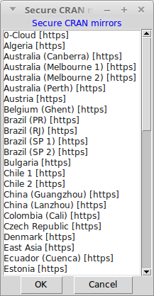

<a name="calculatesingle"></a>
## 4. Calculating the indices from a station text file
[RETURN TO TOP](#toc)

### 4.1 Starting Climpact

Climpact can calculate climate indices for a single location using data stored in a text file, or for a gridded dataset using data stored in netCDF files. This section of the user guide describes how to calculate the Climpact indices for a single location text file (usually a weather station). It is imperative that your text file is formatted according to the guidelines in [Appendix B](#appendixb).

**In Windows**, open R and select *File->Change dir...* and select the *climpact-master* directory created when installing Climpact (see [section 2](#gettinginstalling) if you have not done this). Then run the following commands;

```r
library(shiny)
runApp()
```

**In Linux or MacOS**, open a terminal window and navigate to the *climpact-master* directory created in step 1, then open R in a terminal window (by typing ```R```) and run the following commands;

```r
library(shiny)
runApp()
```

Climpact should then start in your web browser and you should see the home page as pictured below. From here you can follow the on-screen guidance to calculate the indices, or continue reading below.

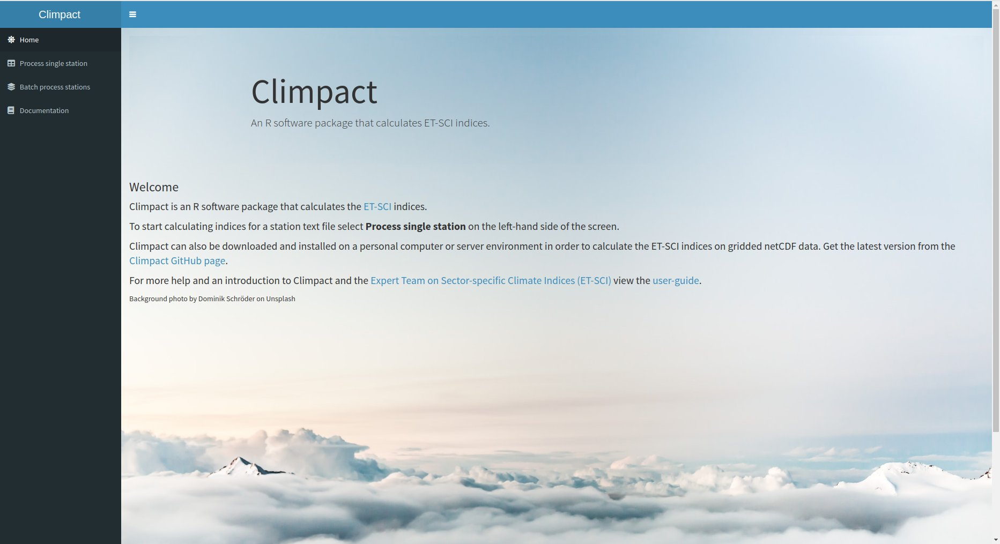

### 4.2 Load data

Different functionality in Climpact is accessed via the tabs on the left hand side of the screen. From the home page select *Process single station* to begin calculating the indices on a station text file. You should then see the following screen which shows4 tabs at the top which highlight the steps to calculate the indices and their correlation to sector data the user may have (this last step is optional).

The first of the 4 steps is to load your text file into Climpact. To do this, select *Browse* and upload your station file. **NOTE: NO STATION DATA IS RETAINED BY CLIMPACT AFTER YOU LEAVE THE SITE.**

After selecting your station file, enter the following information:
* **Station name**: Name of your station.
* **Latitude**: a decimal value between -90 and 90.
* **Longitude**: a decimal value between -180 and 180.
* **Base period start year**: the first year of the time period on which you would like percentile thresholds to be calculated (e.g. if the base period is to be 1961-1990, enter 1961). Confused by what this is for? See [Appendix E](#appendixe).
* **Base period end year**: the last year of the time period on which you would like percentile thresholds to be calculated (e.g. if the base period is to be 1961-1990, enter 1990). Confused by what this is for? See [Appendix E](#appendixe).

Once the above information is entered select the blue *Next* button at the bottom of the screen which will bring you to tab 2.

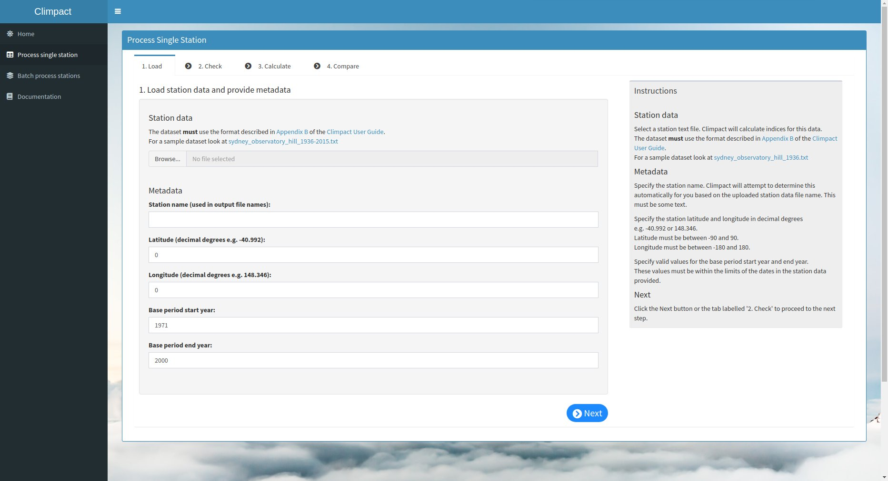

### 4.3 Check data

Tab 2 performs quality control (QC) checks on your data. Click the orange *Check data quality* button and wait for the checks to be performed. Once this is done a slideshow of images previewing the QC results is presented and the user may scroll through these. High resolution versions of these images, along with accompanying .csv files, can be downloaded from the blue text box on the right side of the screen. See [section 6](#outputstation) for guidance on how to interpret the QC output. **Once all QC output has been examined, if any changes are required to the station text file these should be made and the modified file reloaded into Climpact (tab 1) and the QC checks performed and checked again (tab 2).** Once this is done and you are satisfied no errors exist in your data, select the *Next* button at the bottom of the screen which will bring you to tab 3.

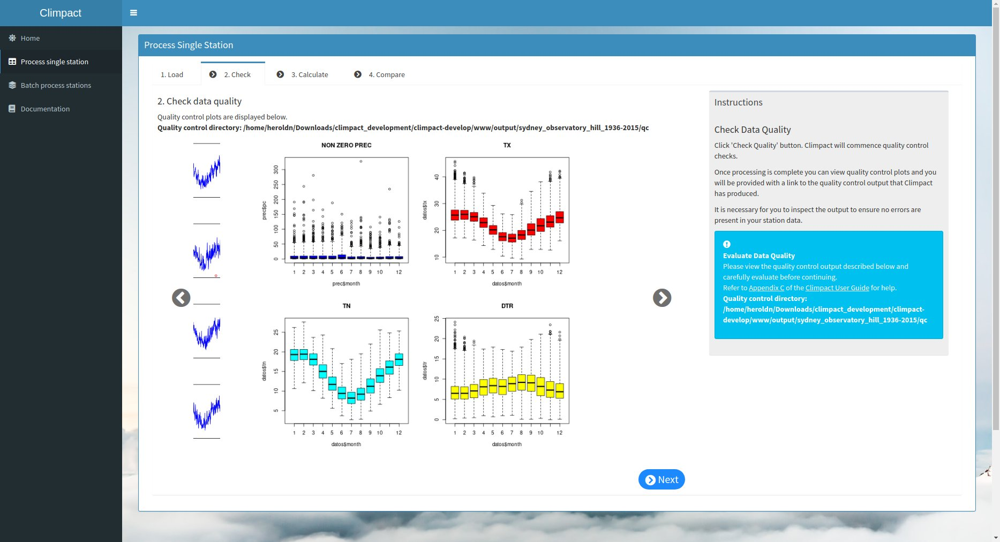

### 4.4 Calculate climate indices

In tab 3 you can change the title that will appear on each plots as well as several parameters affecting how some indices are calculated, as shown in the screenshot below. 

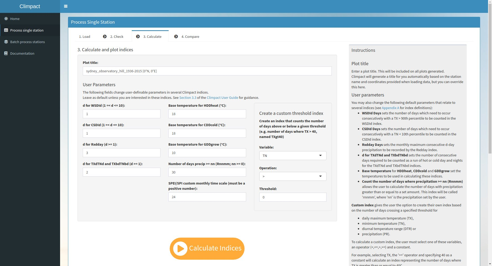

These climate index parameters are described below. Review these before preceding. The definitions of each index can be found in [Appendix A](#appendixa). 

* **d for WSDId Days** sets the number of days which need to occur consecutively with a TX > 90th percentile in order to be counted in the WSDId index. *d* must be at least 1 and no greater than 10.

* **d for CSDId Days** sets the number of days which need to occur consecutively with a TN < 10th percentile in order to be counted in the CSDId index. *d* must be at least 1 and no greater than 10.

* **d for Rxdday Days** sets the maximum consecutive d-day precipitation to be recorded by the Rxdday index. This index is calculated monthly and annually.

* **d for TXdTNd and TXbdTNbd** sets the number of consecutive days required for the TXdTNd and TXbdTNbd indices. 

* **Base temperatures** for HDDheat, CDDcold and GDDgrow set the temperatures to be used in calculating heating-degree-days, cooling-degree-days and growing-degree-days, respectively.

* **Number of days where precipitation >= nn (Rnnmm)** allows the user to calculate the number of days each year and month where precipitation is greater than or equal to a set amount (nn). This index will be called ‘rnnmm’, where ‘nn’ is replaced by the precipitation set by the user.

* **SPEI/SPI custom monthly time scale** sets a custom time scale on which to calculate the SPI and SPEI. These indices are by default already calculated on 3, 6 and 12 month time scales.

* **Custom a custom threshold index** gives the user the option to create their own index based on the number of days crossing a specified threshold for daily maximum temperature (TX), minimum temperature (TN), daily average temperature (TM), diurnal temperature range (DTR) or precipitation (PR). To calculate a custom index, the user must select one of these variables, an operator (<,<=,>,>=) and a threshold constant. For example, selecting TX, the ‘>=’ operator and specifying ‘40’ as a threshold will calculate the number of days where TX is greater than or equal to 40°C, for each year and month. Climpact will output this index as *TXge40*. Operators are abbreviated in text with lt, le, gt and ge for <, <=, > and >=, respectively.

Once the above input boxes have been reviewed and changed where necessary, select the orange *Calculate Indices* button. Calculating the indices normally takes 1 - 2 minutes. Once this is done a blue text box will appear on the right with a link to the created files. Users may have to scroll down the screen to see this box (see screenshot below). Preview plots will also be shown on the web page. See [section 6](#outputstation) for a description of the output files.

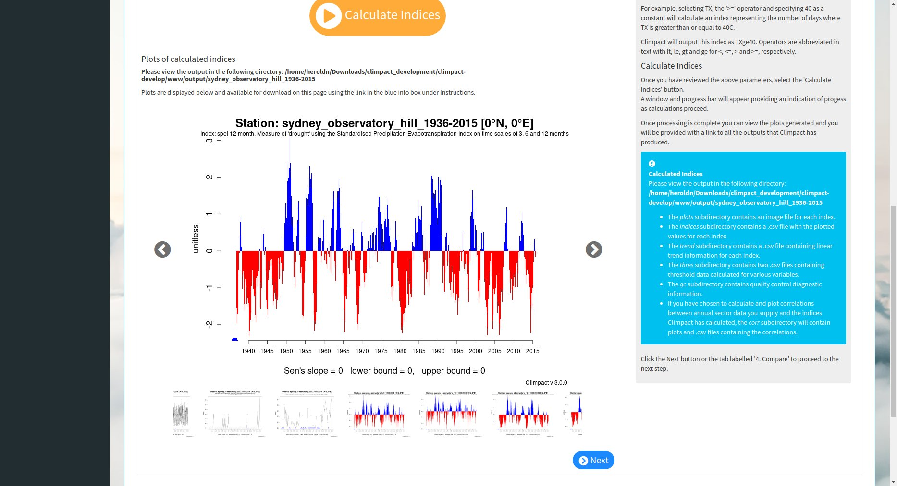

**This is the final step in calculating the Climpact indices.** However, if the user has sector data in the [appropriate format](#appendixb) then they can select the blue "Next" button or tab 4 at the top of the screen to compare the calculated indices to their sector data.

### 4.5 Sector Data Correlation

Climpact can calculate and plot correlations between annual sector data the user has and the indices calculated in tab 3. Use the '4. Compare' tab after you have calculated your indices to do this. Currently, Climpact only calculates correlations for annual sector data. Also note that the indices must have been calculated in the current session of Climpact. If you have closed Climpact and wish to calculate correlations with sector data, you must repeat the process described in sections 4.2 to 4.4 (tabs 1, 2 and 3).

There are only four inputs on tab 4:

* **Selecting the sector data file**. This is a .csv file containing annual data for a sector of interest. See [Appendix B](#appendixb) for details on the format of this file as well as the sample file wheat_yield_nsw_1922-1999.csv stored in ./www/sample_data/.
* **Title** to be used in each plot.
* **Label for y-axis** allows you to set the y-axis label which should represent the name of the data and the units that the values in the .csv file represent.
* **Detrend data** tells Climpact whether to detrend the sector data and climate indices prior to performing comparisons. Detrending is typically very critical when comparing climate and sector data. For example, agricultural yield has increased over the last several decades in many parts of the world due to improved methods of harvesting and increased water efficiency. Without detrending this increasing signal could be incorrectly correlated with increasing temperatures due to climate change and thus a relationship between global warming and increasing yield could be incorrectly interpreted from this.

Once the above inputs are set, select the orange *Calculate Correlations* button. These calculations take several seconds and produce preview plots on the web page, as well as a blue text box on the right side of the screen with a download link to access the created files. See [section 6](#outputstation) for a description of the output files.

<a name="calculatebatch"></a>
## 5. Calculating indices for multiple station (text) files
[RETURN TO TOP](#toc)

Occasionally users will have numerous station files (from dozens to thousands) for which they want to calculate the Climpact indices. For this purpose processing each station individually through the web interface, as described in [section 4](#calculatesingle), would be impractical. The user should instead use either the *Batch process stations* option on the left hand side of the web interface, or use the *climpact.batch.stations.r* script on their local computer, if Climpact has been [installed locally](#gettinginstalling). Both of these options perform the same function, however, users may find using the *climpact.batch.stations.r* script provides greater flexibility for all but the smallest of batch processing jobs.

Whether using the web interface or the *climpact.batch.stations.r* script, all station files for processing must be in the format specified in [Appendix B](#appendixb). Additionally, the batch processing of station files requires a *metadata* file to be created, as is described in the next section.

NOTE: currently sector data statistics are not calculated for batch processed files.

### 5.1 Create a batch processing metadata file

The *metadata* file is a simple text file that contains all of the information the user would normally enter into Climpact when calculating the indices for a single station ([Section 4](#calculatesingle)).

The *metadata* file contains 12 columns described in the following table. A sample metadata file can be found at *www/sample_data/climpact.sample.batch.metadata.txt* and it is suggested the user make a copy and modify this file for their own use. In this file, a separate line is required for each station. Once the *metadata* file has been created the user can proceed to using the *climpact.batch.stations.r* script, or the *Batch process stations* option on the left hand side of the web interface, as described in the following sections.

|Column name|Description|
|---|---|
|station_file|The file name for the station. This should **not** include the directory path. |
|latitude|Latitude of station.|
|longitude|Longitude of station.|
|wsdin|Number of days to calculate WSDI on. See [Appendix A](#appendixa).|
|csdin|Number of days to calculate CSDI on. See [Appendix A](#appendixa).|
|Tb_HDD|Base temperature to use in the calculation of HDDHEAT. See [Appendix A](#appendixa).|
|Tb_CDD|Base temperature to use in the calculation of CDDCOLD. See [Appendix A](#appendixa).|
|Tb_GDD|Base temperature to use in the calculation of GDD. See [Appendix A](#appendixa).|
|rxnday|Number of days across which to calculate Rxnday. See [Appendix A](#appendixa).|
|rnnmm|Precipitation threshold used to calculate Rnnmm. See [Appendix A](#appendixa).|
|txtn|Number of days across which to calculate both nTXnTN and nTXbnTNb. See [Appendix A](#appendixa).|
|SPEI|Custom time scale over which to calculate SPEI and SPI. 3, 6 and 12 months are calculated by default. This could be set to 24 months, for example.|

### 5.2 Using climpact.batch.stations.r to process multiple stations

Unlike the [netCDF wrapper scripts](#calculatenetcdf), the *climpact.batch.stations.r* script does not require modifying but is passed information at runtime in the form of command line arguments. Thus, execution of this script takes the following form, from the Linux/MacOS command line:

```
Rscript climpact.batch.stations.r /full/path/to/station/files/ /full/path/to/metadata.txt base_period_begin base_period_end cores_to_use
```

The 5 command line arguments following *climpact.batch.stations.r* above are described in the following table.

|Command line argument|Description|
|---|---|
|/full/path/to/station/files/|Directory where station files are kept (all station files should be stored in the same directory).|
|/full/path/to/metadata.txt|Text file that contains information about each station file to process. The contents of which are described in the previous table.|
|base_period_begin|Beginning year for the base period. To be used on all stations.|
|base_period_end|Ending year for the base period. To be used on all stations.|
|cores_to_use|Number of processor cores to use. When processing hundreds or thousands of files this is useful.|

An example of executing the *climpact.batch.stations.r* file would be:

```
Rscript climpact.batch.stations.r ./www/sample_data/ ./www/sample_data/climpact.sample.batch.metadata.txt 1971 2000 2
```

As the *climpact.batch.stations.r* script is executed, directories will be created for each station in *www/output/*. In each station's directory several sub-directories are created relating to the different outputs created by Climpact. See [section 6](#outputstation) for a description of this output. 

When calculating the indices for many files, errors are bound to occur. When Climpact encounters an error with a station file during batch processing, the error will be recorded in a text file stored in *www/output/* using the station name appended with *.error.txt*. A list of all error and missing date files contained in *www/output/* will be printed to the terminal after batch processing is complete. These *\*.error.txt* files should be examined and any errors rectified. If there was an error for a particular station then it is likely the indices did not get calculated for that station.

### 5.3 Using the web interface to process multiple stations

The web interface can be used to calculate the Climpact indices for multiple stations. This utilises the same functionality as the *climpact.batch.stations.r* script but may prove less flexible for complex workflows. To use the web interface, first select *Batch process stations* from the left hand side of the Climpact home page.

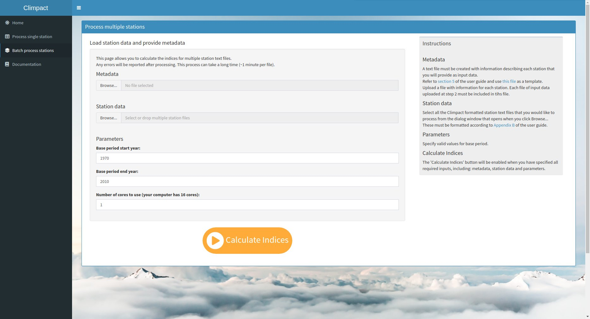

You will then be presented with a screen to provide several inputs:

1. The first dialogue box allows you to select your metadata file, the details of which are described in section 5.1 above. 
1. The second dialogue box allows you to select your stations text files, the format of which is described in [Appendix B](#appendixb). All of the station files you wish to process should be located in the same directory. Multiple files can be selected by holding the *Ctrl* key while selecting files with the mouse.
1. The beginning and end of the base period must also be processed. The base period will be the same for each station file, therefore they must all have a common time period with existing data.
1. Lastly, if you are running Climpact locally you will be able to specify the number of computing cores to use to process your stations. Each station takes ~1-2 minutes on a modern CPU core. If you have many stations it may be preferable to select multiple cores. You will only be allowed to select as many as your computer has. It is not recommended to use all of the cores as this will likely render the computer unusable while processing occurs.

Once the above information has been entered, select the orange *Calculate Indices* button. This process may take a long time. Once it is complete a blue text box will appear on the right side bar with a link to where the output can be viewed or downloaded. 

Importantly, any errors encountered in processing the provided stations will be recorded in *\*.error.txt* files stored in the link provided. When calculating the indices on numerous files, errors are bound to occur. These *\*.error.txt* files should be examined and any errors rectified. If there was an error for a particular station then it is likely the indices did not get calculated for that station.

<a name="outputstation"></a>
## 6. Output for station text files
[RETURN TO TOP](#toc)

When calculating indices on station text files Climpact creates six sub-directories at *www/output/[station_name]*, where [station_name] is the name you entered on the 'Load' tab in [section 4](#calculatesingle), or, if batch processing was conducted these station names will be based on each station's filename. The sub-directories created are listed in the table below and will contain files if [all four steps](#calculatestation) for calculating the indices on a station text file are completed. The subsections that follow describe the output found in these six folders.

|Sub-directory name|Description|
|---------|-------|
|qc|Stores quality-control information related to your station|
|indices|Stores .csv files containing the values for each index|
|plots|Stores .png files containing plots of each index|
|thres|Stores a .csv files containing threshold information|
|trend|Stores a .csv file containing trend information|
|corr|Stores .png and .csv files containing information about the relationship between the calculated indices and the sector data provided.|

### 6.1 Quality control output (the *qc* directory)
***PREFACE****: This section is adapted from text written by Enric Aguilar and Marc Prohom for R functions they created to perform quality control checks, which have been integrated into Climpact with their permission.*

Quality control (QC) diagnostic plots are only calculated for station text files (i.e. they are **not** calculated for netCDF files). While the QC checks performed by Climpact are reasonably extensive, they do not guarantee that all errors are detected. Furthermore, a separate category of QC, that of homogeneity, is often relevant in station data and Climpact does not check for this. Thus it is advised that, if the user is analysing observations (as opposed to model data) that they be aware of the quality of their data before using Climpact and that if necessary they perform additional checks for homogeneity after running the QC checks performed by Climpact (as described in this section). [RHtests](http://etccdi.pacificclimate.org/software.shtml) is one program that performs homogeneity tests. It is freely available, easy to use and also built on the R programming language. See [section 2.5](#homogeneity) for more insight into the importance of homogeneity.

**VIDEO: Presentation on the QC functionality described in this section.**
<br>
[](http://www.youtube.com/watch?v=gusIge2bTNk "")

#### 6.1.1 An overview of the quality control output files

Once the user selects the *Check* button under tab 2 (see [section 4](#calculatesingle)) Climpact will perform QC checks on the user-provided station file. At the end of this process a dialogue box will appear telling the user to check the *qc* sub-directory created in *climpact-master/www/output/[station_name]*. QC checks will also be performed automatically when conducting [batch processing](#calculatebatch). 

The *qc* folder contains the following files (where *mystation* refers to the name of the user’s station file):

**8 .pdf files**, with graphical information on data quality:
<br>
mystation_tminPLOT.pdf
<br>
mystation_tmaxPLOT.pdf
<br>
mystation_dtrPLOT.pdf
<br>
mystation_prcpPLOT.pdf
<br>
mystation_boxes.pdf
<br>
mystation_boxseries.pdf
<br>
mystation_rounding.pdf
<br>
mystation_ALL_QC_OUTPUT.pdf

**9 .csv files** with numerical information on data quality
<br>
mystation_duplicates.csv
<br>
mystation_outliers.csv
<br>
mystation_tmaxmin.csv
<br>
mystation_tx_flatline.csv
<br>
mystation_tn_flatline.csv
<br>
mystation_toolarge.csv
<br>
mystation_tx_jumps.csv
<br>
mystation_tn_jumps.csv
<br>
mystation_temp_nastatistics.csv

**Multiple .png files** replicating the information in the .pdf files listed above. The number of .png files depends on the length of the station record. These are the files previewed in the web interface.

#### 6.1.2 Descriptions of file contents

**mystation_tminPLOT.pdf
<br>
mystation_tmaxPLOT.pdf
<br>
mystation_dtrPLOT.pdf
<br>
mystation_prcpPLOT.pdf**

These files contain simple plots of the daily time-series of minimum temperature, maximum temperature, diurnal temperature range and precipitation, respectively. This allows the user to view the data and identify obvious problems by eye, such as missing data (indicated by red circles) or unrealistic values.

Below is an example for tmax.

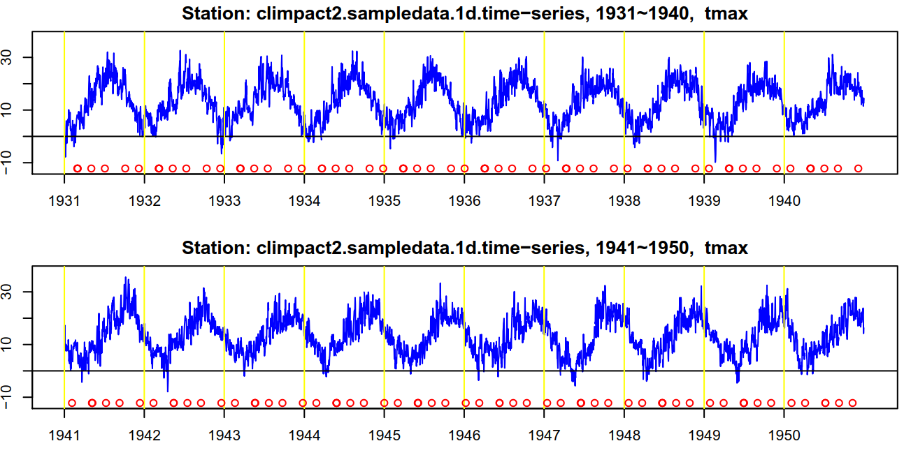

**mystation_boxes.pdf**

This file identifies potential outliers based on the interquartile (IQR). The IQR is defined as the difference between the 75th (p75) and the 25th (p25) percentiles. As can be seen in the example below, mystation_boxes.pdf contains boxplots of temperature and precipitation data flagging as outliers (round circles) all those temperature values falling outside a range defined by p25 – 3 interquartile ranges (lower bound) and p75 + 3 interquartile ranges (upper bound). For precipitation, 5 IQR are used.

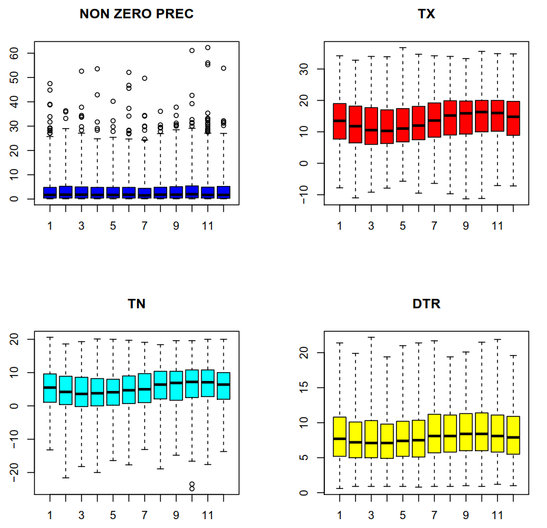

The values identified by this graphical quality control are sent to a .csv file (*mystation_outliers.csv* for our example station). This file lists the outliers grouped under the corresponding variable and the **UP**per or **LOW**er margins of the IQR, depending on whether the outlier is a high or low outlier, respectively. An example of the contents of this file are shown below. Under **Prec up* appear those values that represent a precipitation outlier; under *TX up* are those that represent a maximum temperature higher than p75+3\*IQR; under *TX low* are outliers that represent an observation lower than p25-3\*IQR. The explanation given for TX, also applies to TN and DTR. The advantage of this approach is that the detection of this percentile based outliers is not affected by the presence of larger outliers, so ONE RUN OF THE QC PROCESS IS ENOUGH.

```
Date    Prec     TX       TN       DTR
Prec up                                               
2/01/1951        31.8     14.3     10.2     4.1
12/01/1961      47.5     23.4     11.4     12
5/04/1963        42.8     19.2     13.6     5.6
18/04/1967      29.1     20.2     11.8     8.4
19/04/1969      28.2     27.7     17.9     9.8
19/04/1973      53.6     14.8     11.1     3.7
21/11/1991      55.9     11.4     7.8       3.6
11/11/1995      32.1     18.4     13.5     4.9
1/12/2000        31.6     18.6     12.6     6
31/12/2001      32.1     16        9.4       6.6
15/12/2005      30.2     22.1     13.3     8.8
TX up
TX low             
TN up
TN low
30/10/1972      2.5       -11.2    -23.4    12.2
31/10/1972      4.3       -4.8      -24.8    20
DTR up
DTR low
```

**mystation_boxseries.pdf**

The graphic file boxseries.pdf (which does not have a numerical counterpart) produces annual boxplots. This file is useful to have a panoramic view of the series and be alerted of parts of the series which can be problematic. An example of this file is shown below.

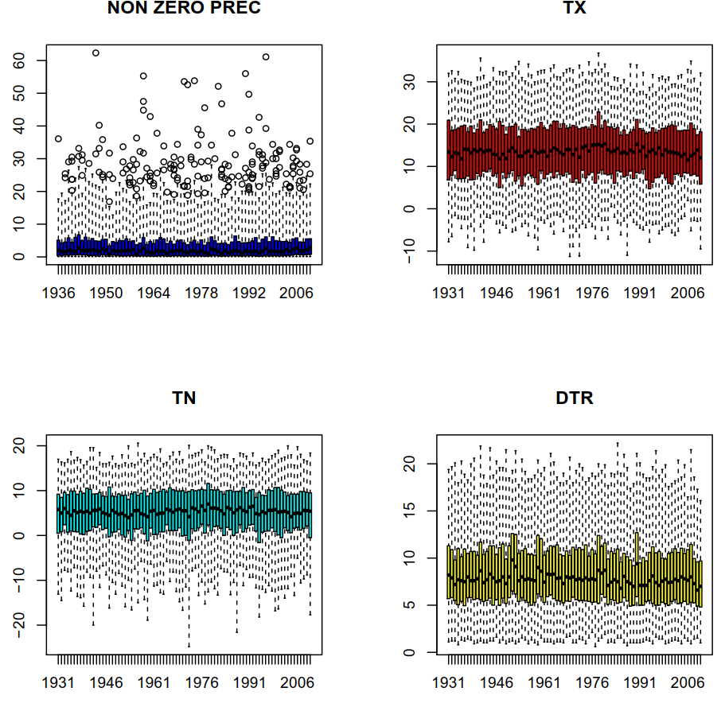

**mystation_rounding.pdf**

This file looks at rounding problems by plotting the frequency of each decimal value. It shows how frequently each of the 10 possible values is used at a precision of 1 decimal place (i.e .0 to .9). It is not uncommon that .0 and .5 are more frequent at stations simply because of human rounding (there is no statistical reason for these values to occur more often!).

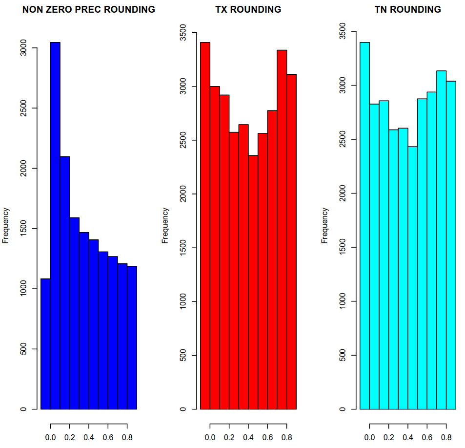

**mystation_tn_flatline.csv**
<br>
**mystation_tx_flatline.csv**

The mystation_tn_flatline.csv and mystation_tx_flatline.csv files report occurrences of 4 or more equal consecutive values in, respectively, TX and TN. A line for each sequence of 4 or more consecutive equal values is generated. In the example below all sequences are 4 values long (i.e. each corresponding value has been repeated 3 extra times). The date specified belongs to the end of the sequence.

```
Date    TX       Number of duplicates
4/09/1937        18        3
28/11/1937      16.9     3
```

Looking at the data, the first sequence identified by the QC test above is shown below.

```
1937    9          1          0          16.4     11.6
1937    9          2          0          18        10.2
1937    9          3          0          18        8.6
1937    9          4          0          18        7
``` 

**mystation_duplicates.csv**

The file mystation_duplicates.csv includes all dates which appear more than once in a datafile. In the listing below, one can see that 1951/08/26 occurs twice, and thus will be reported in mystation_duplicates.csv.

```
1951 8 24
1951 8 25
1951 8 26
1951 8 26
1951 8 28
1951 8 29
1951 8 30
1951 8 31
```

**mystation_toolarge.csv**

The file mystation_toolarge.csv reports precipitation values exceeding 200 mm and temperature values exceeding 50 ºC.

**mystation_tx_jumps.csv**
**mystation_tn_jumps.csv**

The files mystation_tx_jumps.csv and mystation_tn_jumps.csv will list those dates where the temperature difference with the previous day is 20 ºC or higher.

**mystation_tmaxmin.csv**

The mystation_tmaxmin.csv file, records all those dates where maximum temperature is lower than minimum temperature.

**mystation_temp_nastatistics.csv**

This file lists the number of missing values that exists for each variable (TX, TN, PR) for each year.

### 6.2 Climpact indices and plots (the *plots* and *indices* directories)

Climpact produces two sub-directories under *www/output/[station_name]* where the results of each index are stored, *plots* and *indices*. For each index one image file (.png) containing a plot of the index and one comma-separated value file (.csv) containing the index values are created and put into the the *plots* and *indices* directories, respectively. The .csv files can be opened in Microsoft Excel, the freely available [Libre Office Calc](https://libreoffice.org/) or any text editor. The index files have filenames “mystation_XXX_YYY.csv” where XXX represents the short name of the index (see [Appendix A](#appendixa)) and YYY is either ANN or MON depending on whether the index has been calculated annually or monthly, respectively. 

A portion of a sample .csv file for the index *su* is shown below. There is one value for each year the index is calculated. For indices calculated monthly there will be one value per month. A column containing normalised values is also written for most indices (these values are normalised using all available years/months). **Note that any years or months where insufficient data exists will have the missing value -99.9 and these should be removed if performing spreadsheet calculations.**

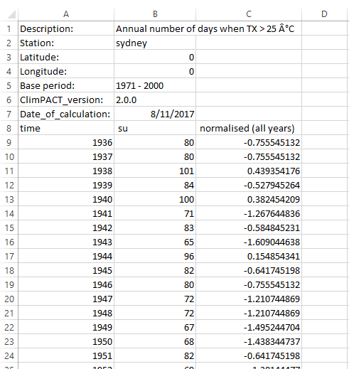

An example plot for the index *su* is shown below. These files may be opened in any standard image viewing software. The Sen's slope is displayed at the bottom of the plot along with the lower and upper bounds of the 95% confidence interval (these are calculated with the [zyp](https://cran.r-project.org/web/packages/zyp/index.html) package in R). In addition, one .pdf file ending in \*_all_plots.pdf, is produced in the *plots* directory. This file contains all index plots concatenated together and is provided for easier viewing.

See [Appendix A](#appendixa) for definitions of each Climpact index.

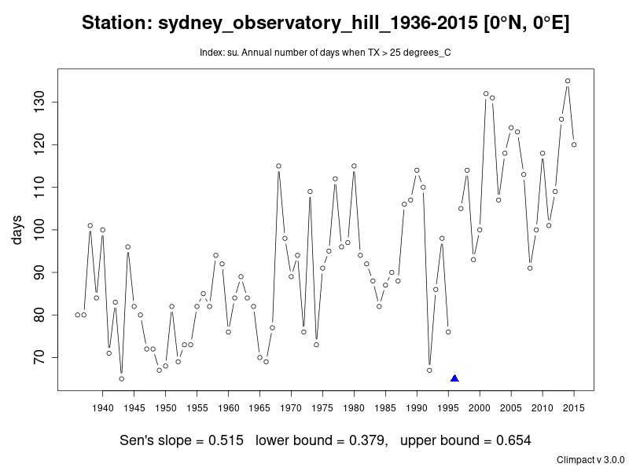

### 6.3 Threshold and trend data (the *thres* and *trend* directories)

The *thres* directory contains a .csv file named after the relevant station and ending with \*_thres.csv. This \*_thres.csv file contains the percentile thresholds used by Climpact to calculate the percentiles-based indices, such as TX90p (which calculates the percentage of days above the 90th percentile). There are 365 rows, corresponding to each day of the year. As described in [Appendix C](#appendixc), percentile thresholds are calculated using a 5 day moving window (with the exception of heatwave percentiles which use 15 day moving windows, see [Appendix D](#appendixd)). Each column is named after the variable and the percentile being reported, e.g. *tmin_q10* is the 10th percentile of minimum daily temperature (TN). Since TX, TN and TAVG use a different size moving window to the percentiles for heatwaves, the heatwave percentiles are recorded separately in the last three columns. The information in this file is provided purely for interest and may be helpful in further understanding the climate at your location.

The *trend* directory contains a .csv file named after the relevant station and ending with \*_trend.csv. This \*_trend.csv file contains all of the trend information printed at the bottom of each plot for each index. This is to aid comparison of trends between indices. Trends for calendar seasons (DJF, MAM, JJA, SON) are also provided for indices that include monthly values. 

The trends calculated by Climpact are based on [Sen's slope](https://www.tandfonline.com/doi/abs/10.1080/01621459.1968.10480934) (using the [zyp](https://cran.r-project.org/web/packages/zyp/index.html) package in R). Sen's slope reflects the median slope of all ordered pairs of points in a dataset and is more appropriate for calculating trends in extreme values - compared to other common trend estimators like the method of least-squares - since it is less impacted by outliers. 95% confidence intervals are calculated for the slope and the lower and upper bounds reported in each plot and in the \*_trend.csv file.

### 6.4 Sector data (the *corr* directory)

Climpact can also calculate basic statistics between the extremes indices it calculates and user-provided sector data. [Section 4](#calculatesingle) describes how to calculate sector statistics. Refer to [Appendix B](#appendixb) for guidance on how sector data must be formatted. Currently, the sector data must be annual. 

Specifically, Climpact calculates correlations between each index and the user's sector data, as well as regressions of the sector data onto the minimum, maximum and average daily temperatures.

Below is an example of the bar chart produced which shows the correlation coefficient between Climpact indices and sector data. Precipitation-related indices are represented by blue bars and temperature-related indices by red bars. Coefficients are reported on each bar.

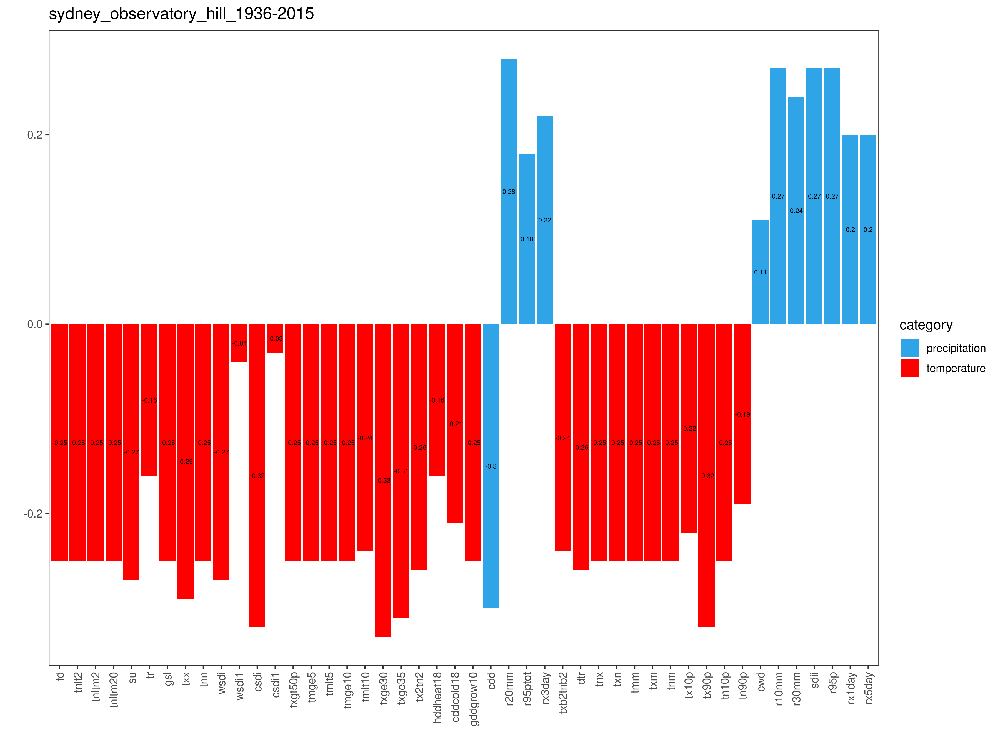

Below is an example of a regression plot between maximum temperature and sector data. R-squared values and regression line equations are also shown. Regardless of whether the variable being regressed onto is the daily minimum, maximum or average, all of this data is averaged annually in order to perform the regression.

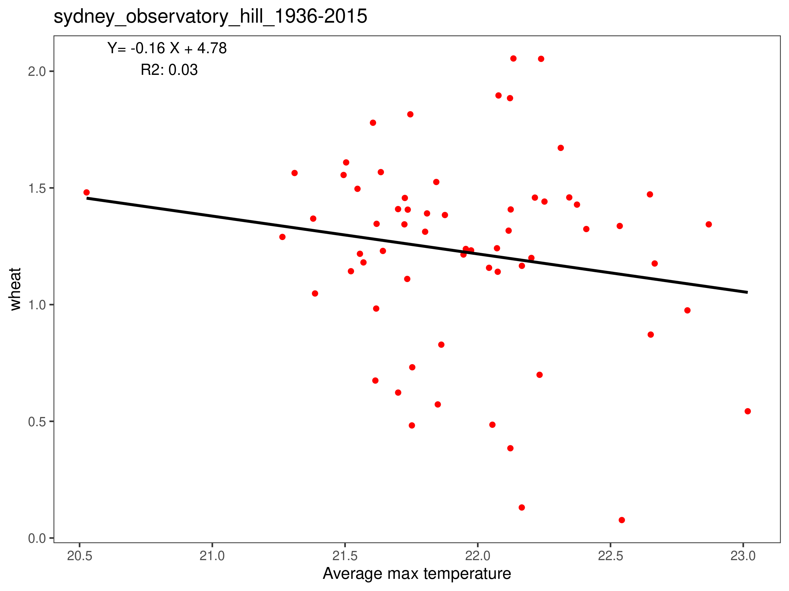

<a name="calculatenetcdf"></a>
## 7. Calculating the indices from netCDF files
[RETURN TO TOP](#toc)

**WARNING: This functionality is intended for users familiar with the command line.**

Users who have gridded netCDF files with daily minimum and maximum temperature and daily precipitation (or at least one of these) may also calculate the Climpact indices. This process utilises the wrapper scripts *climpact.ncdf.wrapper.r* and, optionally, the *climpact.ncdf.thresholds.wrapper.r*. The user must modify these scripts and execute them from the Linux or MacOS command line. Note that to follow these instructions Climpact must be installed locally (see [section 3](#gettinginstalling)).

See [Appendix B](#appendixb) to ensure your data is in the correct format.

### 7.1 Using the netCDF wrapper scripts

The *climpact.ncdf.wrapper.r* script calculates the Climpact indices on the specified netCDF file(s). The three input variables that Climpact requires can be stored in a single file or in separate files. To use this script, make a copy of it and edit the parameters inside according to your data (**the comments in this file will guide you in making edits**). It is highly recommended that you make a copy of this file and do not alter the original. 

As a first step, it is recommended to test that the original wrapper script runs successfully before running your own modified version. Doing so will calculate the indices on the provided sample data and confirm that Climpact is installed correctly.

If you wish to calculate the indices for data contained in one set of netCDF files but using percentiles from a base period contained in another set of netCDF files, then the *climpact.ncdf.thresholds.wrapper.r* will need to be used. This file calculates and stores a set of percentile thresholds calculated from one set of files, in order to be used to calculate the Climpact indices on another set of files. See the comments in this wrapper script for guidance on any edits to make.

### 7.2 A typical use case of the wrapper scripts

A typical example for using these scripts is illustrated below.

The user has three netCDF files containing model simulated daily precipitation, maximum temperature and minimum temperature for the present day period of 1980 - 2010. The user also has a netCDF file containing climate projections for the period 2050 - 2080. They want to calculate the Climpact indices for both of these periods but want the percentile-based indices in both the present and future datasets to utilise thresholds calculated from the present dataset. For a brief explanation of thresholds-based indices refer to [Appendix C](#appendixc).

To calculate the indices in the above scenario requires three steps:

1. Make a copy of climpact.ncdf.wrapper.r (e.g. climpact.ncdf.wrapper.HISTORICAL.r) and modify it to point to the present day netCDF files, specifying your desired base period. In the above example this might be 1980 - 2000 (your base period does NOT have to cover the entire range of data in your file(s)). Run this script from the command line using ```Rscript climpact.ncdf.wrapper.HISTORICAL.r```. This will calculate the indices for the present day data.

2. Make a copy of climpact.ncdf.thresholds.wrapper.r (e.g. climpact.ncdf.thresholds.wrapper.HISTORICAL.r) and modify it to point to the same present day netCDF files used in step 1. Here the user needs to specify the same base period, e.g. 1980 - 2000. Run this script from the command line using ```Rscript climpact.ncdf.thresholds.wrapper.HISTORICAL.r```. The output of this will be a single netCDF file containing percentile threshold values. Note step 1 and 2 can technically be done in any order, step 2 is only required in order to complete step 3. **If you only have one time period to calculate the indices for you can stop after step 1.**

3. Make another copy of climpact.ncdf.wrapper.r (e.g. climpact.ncdf.wrapper.FUTURE.r) and modify it to point to the future climate netCDF files, specifying a base period consistent with the above steps (e.g. 1980 - 2000) but this time specify the threshold file that was calculated in step 2 above, as opposed to setting it to NULL. Run this script from the Linux command line using ```Rscript climpact.ncdf.wrapper.FUTURE.r```.

These scripts typically take many, many hours to run and runtime varies strongly based on input file size and computer resources. Therefore it is intended for these scripts to be run in a server environment. However, the sample file provided with Climpact (which is a very low resolution dataset) should only take 10-20 minutes to run on a modern laptop or desktop computer. 

Once you have run climpact.ncdf.wrapper.r, numerous netCDF files will exist in the output directory specified. Where relevant, indices are calculated at both monthly and annual time scales. Output filenames follow the filename conventions of phase 5 of the Coupled Modelling Intercomparison Project (CMIP5) and a typical example is r20mm_ETCCDI_ANN_climpact.sample_historical_NA_1991-2010.nc, where *r20mm* refers to the index calculated and ANN refers to the time scale this index was calculated on (MON for monthly). Strictly, the CMIP5 conventions follow this format var_timeresolution_model_scenario_run_starttime-endtime.nc.


<a name="outputgridded"></a>
## 8. Examining output for netCDF files
[RETURN TO TOP](#toc)

NetCDF files require special software for viewing and manipulating. We recommend using [Panoply](https://www.giss.nasa.gov/tools/panoply/) for easily viewing netCDF output (and can also generate animations), it is freely available and works under Linux, MacOS and Windows. To access and manipulate netCDF files requires a programming language such as R (which you already have installed!), Python, Matlab or many others. A visualisation from Panoply of the Standardised Precipitation-Evapotranspiration Index (SPEI) calculated over Australia is shown below.

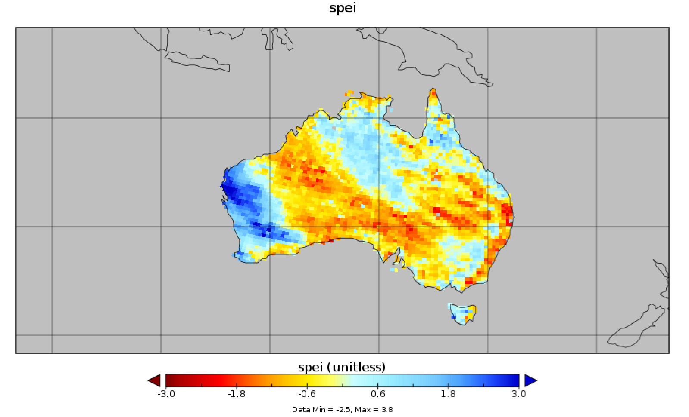

<a name="appendixa"></a>
## Appendix A: Tables of Climpact indices
[RETURN TO TOP](#toc)

To calculate all of the Climpact indices time-series of daily minimum temperature (TN), daily maximum temperature (TX) and daily precipitation (PR) are required. Daily mean temperature (TM) is calculated from TM = (TX + TN)/2. Diurnal temperature range (DTR) is calculated from DTR = TX - TN. Many indices are calculated at both annual and monthly time scales. For some indices in the following table, the sector(s) of relevance to each index are indicated as determined by the ET-SCI in consultation with sector representatives, where H=Health, AFS=Agriculture and Food Security and WRH=Water Resources and Hydrology. Some indices have not been evaluated against specific sectors. Note also that the Climpact web interface allows users to create their own absolute day count index as detailed in [section 4](#calculatesingle). 

**Table A1. The table below describes all of the indices calculated by Climpact (as agreed by the ET-SCI July 2011. Updated index names and definitions May 2016). Bold indicates indices also recommended by the ETCCDI (see [Zhang et al., 2011](#appendixa_refs)).**

|Short name| Long name |Definition|Plain language description|Units|Time scale|Sector(s)|
|---|---|---|---|---|---|---|
|FD|Frost Days|Number of days when TN < 0 °C|Days when minimum temperature is below 0°C|days|Mon/Ann|H, AFS|
|TNlt2|TN below 2°C|Number of days when TN < 2 °C|Days when minimum temperature is below 2°C|days|Mon/Ann|AFS|
|TNltm2|TN below -2°C|Number of days when TN < -2 °C|Days when minimum temperature is below -2°C|days|Mon/Ann|AFS|
|TNltm20|TN below -20°C|Number of days when TN < -20 °C|Days when minimum temperature is below -20°C|days|Mon/Ann|H, AFS|
|ID|Ice Days|Number of days when TX < 0 °C|Days when maximum temperature is below 0°C|days|Mon/Ann|H, AFS|
|SU|Summer days|Number of days when TX > 25 °C|Days when maximum temperature exceeds 25°C|days|Mon/Ann|H|
|TR|Tropical nights|Number of days when TN > 20 °C|Days when minimum temperature exceeds 20°C|days|Mon/Ann|H,AFS|
|GSL|Growing Season Length|Annual number of days between the first occurrence of 6 consecutive days with TM > 5 °C and the first occurrence of 6 consecutive days with TM < 5 °C|Length of time in which plants can grow|days|Ann|AFS|
|TXx|Max TX|Warmest daily TX|Hottest day|°C|Mon/Ann|AFS|
|TNn|Min TN|Coldest daily TN|Coldest night|°C|Mon/Ann|AFS|
|WSDI|Warm spell duration indicator|Annual number of days contributing to events where 6 or more consecutive days experience TX > 90th percentile|Number of days contributing to a warm period (where the period has to be at least 6 days long)|days|Ann|H, AFS, WRH|
|WSDId|User-defined WSDI|Annual number of days contributing to events where d or more consecutive days experience TX > 90th percentile|Number of days contributing to a warm period (where the minimum length is user-specified)|days|Ann|H, AFS, WRH|
|CSDI|Cold spell duration indicator|Annual number of days contributing to events where 6 or more consecutive days experience TN < 10th percentile|Number of days contributing to a cold period (where the period has to be at least 6 days long)|days|Ann|H, AFS|
|CSDId|User-defined CSDI|Annual number of days contributing to events where d or more consecutive days experience TN < 10th percentile|Number of days contributing to a cold period (where the minimum length is user-specified)|days|Ann|H, AFS, WRH|
|TXgt50p|Fraction of days with above average temperature|Percentage of days where TX > 50th percentile|Fraction of days with above average temperature|%|Mon/Ann|H, AFS, WRH|
|TX95t|Very warm day threshold|Value of 95th percentile of TX|A threshold where days above this temperature would be classified as very warm|°C|Daily|H, AFS|
|TMge5|TM of at least 5°C|Number of days when TM >= 5 °C|Days when average temperature is at least 5°C|days|Mon/Ann|AFS|
|TMlt5|TM below 5°C|Number of days when TM < 5 °C|Days when average temperature is below 5°C|days|Mon/Ann|AFS|
|TMge10|TM of at least 10°C|Number of days when TM >= 10 °C|Days when average temperature is at least 10°C|days|Mon/Ann|AFS|
|TMlt10|TM below 10°C|Number of days when TM < 10 °C|Days when average temperature is below 10°C|days|Mon/Ann|AFS|
|TXge30|TX of at least 30°C|Number of days when TX >= 30 °C|Days when maximum temperature is at least 30°C|days|Mon/Ann|H, AFS|
|TXge35|TX of at least 35°C|Number of days when TX >= 35 °C|Days when maximum temperature is at least 35°C|days|Mon/Ann|H, AFS|
|TXdTNd|User-defined consecutive number of hot days and nights|Annual count of d consecutive days where both TX > 95th percentile and TN > 95th percentile, where 10 >= d >= 2|Total consecutive hot days and hot nights (where consecutive periods are user-specified)|events|Ann|H, AFS, WRH|
|HDDheatn|Heating Degree Days|Annual sum of n - TM (where n is a user-defined location-specific base temperature and TM < n)|A measure of the energy demand needed to heat a building|degree-days|Ann|H|
|CDDcoldn|Cooling Degree Days|Annual sum of TM - n (where n is a user-defined location-specific base temperature and TM > n)|A measure of the energy demand needed to cool a building|degree-days|Ann|H|
|GDDgrown|Growing Degree Days|Annual sum of TM - n (where n is a user-defined location-specific base temperature and TM > n)|A measure of heat accumulation to predict plant and animal developmental rates|degree-days|Ann|H, AFS|
|CDD|Consecutive Dry Days|Maximum number of consecutive dry days (when PR < 1.0 mm)|Longest dry spell|days|Mon/Ann|H, AFS, WRH|
|R20mm|Number of very heavy rain days|Number of days when PR >= 20 mm|Days when rainfall is at least 20mm|days|Mon/Ann|AFS, WRH|
|PRCPTOT|Annual total wet-day PR|Sum of daily PR >= 1.0 mm|Total wet-day rainfall|mm|Mon/Ann|AFS, WRH|
|R95pTOT|Contribution from very wet days|100*r95p / PRCPTOT|Fraction of total wet-day rainfall that comes from very wet days|%|Ann|AFS, WRH|
|R99pTOT|Contribution from extremely wet days|100*r99p / PRCPTOT|Fraction of total wet-day rainfall that comes from extremely wet days|%|Ann|AFS, WRH|
|RXdday|User-defined consecutive days PR amount|Maximum d-day PR total|Maximum amount of rain that falls in a user-specified period|mm|Mon/Ann|H, AFS, WRH|
|SPI|Standardised Precipitation Index|Measure of “drought” using the Standardised Precipitation Index on time scales of 3, 6 and 12 months. See [McKee et al. (1993)](#appendixa_refs) and the [WMO SPI User guide (World Meteorological Organization, 2012)](#appendixa_refs) for details.<br>Calculated using the [SPEI R package](https://cran.r-project.org/web/packages/SPEI/index.html).|A drought measure specified as a precipitation deficit|unitless|Custom|H, AFS, WRH|
|SPEI|Standardised Precipitation Evapotranspiration Index|Measure of “drought” using the Standardised Precipitation Evapotranspiration Index on time scales of 3, 6 and 12 months. See [Vicente-Serrano et al. (2010)](#appendixa_refs) for details.<br>Calculated using the [SPEI R package](https://cran.r-project.org/web/packages/SPEI/index.html).|A drought measure specified using precipitation and evaporation|unitless|Custom|H, AFS, WRH|
|TXbdTNbd|User-defined consecutive number of cold days and nights|Annual number of d consecutive days where both TX < 5th percentile and TN < 5th percentile, where 10 >= d >=2|Total consecutive cold days and cold nights (where consecutive periods are user-specified)|events|Ann|H, AFS, WRH|
|DTR|Daily Temperature Range|Mean difference between daily TX and daily TN|Average range of maximum and minimum temperature|°C|Mon/Ann||
|TNx|Max TN|Warmest daily TN|Hottest night|°C|Mon/Ann||
|TXn	|Min TX|Coldest daily TX|Coldest day|°C|Mon/Ann||
|TMm|Mean TM|Mean daily mean temperature|Average daily temperature|°C|Mon/Ann||
|TXm|Mean TX|Mean daily maximum temperature|Average daily maximum temperature|°C|Mon/Ann||
|TNm|Mean TN|Mean daily minimum temperature|Average daily minimum temperature|°C|Mon/Ann||
|TX10p|Amount of cool days|Percentage of days when TX < 10th percentile|Fraction of days with cool day time temperatures|%|Ann||
|TX90p|Amount of hot days|Percentage of days when TX > 90th percentile|Fraction of days with hot day time temperatures|%|Ann||
|TN10p|Amount of cold nights|Percentage of days when TN < 10th percentile|Fraction of days with cold night time temperatures|%|Ann||
|TN90p|Amount of warm nights|Percentage of days when TN > 90th percentile|Fraction of days with warm night time temperatures|%|Ann||
|CWD|Consecutive Wet Days|Maximum annual number of consecutive wet days (when PR >= 1.0 mm)|The longest wet spell|days|Ann||
|R10mm|Number of heavy rain days|Number of days when PR >= 10 mm|Days when rainfall is at least 10mm|days|Mon/Ann||
|Rnnmm|Number of customised rain days|Number of days when PR >= nn|Days when rainfall is at least a user-specified number of mm|days|Mon/Ann||
|SDII|Daily PR intensity|Annual total PR divided by the number of wet days (when total PR >= 1.0 mm)|Average daily wet-day rainfall intensity|mm/day|Ann||
|R95p|Total annual PR from heavy rain days|Annual sum of daily PR > 95th percentile|Amount of rainfall from very wet days|mm|Ann||
|R99p|Total annual PR from very heavy rain days|Annual sum of daily PR > 99th percentile|Amount of rainfall from extremely wet days|mm|Ann||
|Rx1day|Max 1-day PR|Maximum 1-day PR total|Maximum amount of rain that falls in one day|mm|Mon/Ann||
|Rx5day|Max 5-day PR|Maximum 5-day PR total|Maximum amount of rain that falls in five consecutive days|mm|Mon/Ann|
|HWN(EHF/Tx90/Tn90)|Heatwave number (HWN) as defined by either the Excess Heat Factor (EHF), 90th percentile of TX or the 90th percentile of TN|The number of individual heatwaves that occur each summer (Nov – Mar in southern hemisphere and May – Sep in northern hemisphere). A heatwave is defined as 3 or more days where either the EHF is positive, TX > 90th percentile of TX or where TN > 90th percentile of TN. Where percentiles are calculated from base period specified by user.|See Appendix D and [Perkins and Alexander (2013)](#appendixa_refs) for more details.|Number of individual heatwaves events|Ann|H, AFS, WRH|
|HWF(EHF/Tx90/Tn90)|Heatwave frequency (HWF) as defined by either the Excess Heat Factor (EHF), 90th percentile of TX or the 90th percentile of TN|The number of days that contribute to heatwaves as identified by HWN.|See Appendix D and [Perkins and Alexander (2013)](#appendixa_refs) for more details.|days|Ann|H, AFS, WRH|
|HWD(EHF/Tx90/Tn90)|Heatwave duration (HWD) as defined by either the Excess Heat Factor (EHF), 90th percentile of TX or the 90th percentile of TN|The length of the longest heatwave identified by HWN.|See Appendix D and [Perkins and Alexander (2013)](#appendixa_refs) for more details.|days|Ann|H, AFS, WRH|
|HWM(EHF/Tx90/Tn90)|Heatwave magnitude (HWM) as defined by either the Excess Heat Factor (EHF), 90th percentile of TX or the 90th percentile of TN|The mean temperature of all heatwaves identified by HWN.|See Appendix D and [Perkins and Alexander (2013)](#appendixa_refs) for more details.|°C (°C^2 for  EHF)|Ann|H, AFS, WRH|
|HWA(EHF/Tx90/Tn90)|Heatwave amplitude (HWA) as defined by either the Excess Heat Factor (EHF), 90th percentile of TX or the 90th percentile of TN|The peak daily value in the hottest heatwave (defined as the heatwave with highest HWM).|See Appendix D and [Perkins and Alexander (2013)](#appendixa_refs) for more details.|°C (°C^2 for  EHF)|Ann|H, AFS, WRH|
|CWN_ECF|Coldwave number (CWN) as defined by the Excess Cold Factor (ECF).|The number of individual ‘coldwaves’ that occur each year.|See Appendix D and [Nairn and Fawcett (2013)](#appendixa_refs) for more information.|events|Ann|H, AFS, WRH|
|CWF_ECF|Coldwave frequency (CWF) as defined by the Excess Cold Factor (ECF).|The number of days that contribute to ‘coldwaves’ as identified by ECF_HWN.|See Appendix D and [Nairn and Fawcett (2013)](#appendixa_refs) for more information.|days|Ann|H, AFS, WRH|
|CWD_ECF|Coldwave duration (CWD) as defined by the Excess Cold Factor (ECF).|The length of the longest ‘coldwave’ identified by ECF_HWN.|See Appendix D and [Nairn and Fawcett (2013)](#appendixa_refs) for more information.|days|Ann|H, AFS, WRH|
|CWM_ECF|Coldwave magnitude (CWM) as defined by the Excess Cold Factor (ECF).|The mean temperature of all ‘coldwaves’ identified by ECF_HWN.|See Appendix D and [Nairn and Fawcett (2013)](#appendixa_refs) for more information.|°C^2|Ann|H, AFS, WRH|
|CWA_ECF|Coldwave amplitude (CWA) as defined by the Excess Cold Factor (ECF).|The minimum daily value in the coldest ‘coldwave’ (defined as the coldwave with lowest ECF_HWM).|See Appendix D and [Nairn and Fawcett (2013)](#appendixa_refs) for more information.|°C^2|Ann|H, AFS, WRH|

<a name="appendixa_refs"></a>
### Appendix A references
McKee T B, Doesken N J and Kleist J 1993 The relationship of drought frequency and duration to time scales Proceedings of the 8th Conference on Applied Climatology vol 17 (American Meteorological Society Boston, MA, USA) pp 179–83

Nairn J R and Fawcett R G 2013 Defining heatwaves: heatwave defined as a heat-impact event servicing all community and business sectors in Australia (Centre for Australian Weather and Climate Research) Online: http://www.cawcr.gov.au/technical-reports/CTR_060.pdf

Perkins S E and Alexander L V 2013 On the Measurement of heatwaves J. Clim. 26 4500–17 Online: http://dx.doi.org/10.1175/JCLI-D-12-00383.1

Vicente-Serrano S M, Beguería S and López-Moreno J I 2010 A Multiscalar Drought Index Sensitive to Global Warming: The Standardized Precipitation Evapotranspiration Index J. Clim. 23 1696–718 Online: http://dx.doi.org/10.1175/2009JCLI2909.1

WMO 2012 Standardized Precipitation Index User Guide (7 bis, avenue de la Paix – P.O. Box 2300 – CH 1211 Geneva 2 – Switzerland) Online: http://www.wamis.org/agm/pubs/SPI/WMO_1090_EN.pdf

Zhang X, Alexander L, Hegerl G C, Jones P, Tank A K, Peterson T C, Trewin B and Zwiers F W 2011 Indices for monitoring changes in extremes based on daily temperature and precipitation data Wiley Interdiscip. Rev. Clim. Chang. 2 851–70 Online: https://onlinelibrary.wiley.com/doi/full/10.1002/wcc.147

<a name="appendixb"></a>
## Appendix B: Input data format
[RETURN TO TOP](#toc)

### B.1 Station text file format

Users should use the sample input file provided with Climpact as a template for preparing their own data (sydney_observatory_hill_1936-2015.txt). Station text files have the following requirements:

1. They must be an ASCII text file.
1. They must consist of the following six columns only: Year, Month, Day, PR, TX, TN. NOTE: PR units are in millimeters and TX/TN units are degrees Celsius.
1. There should be one row for each day in the record.
1. Days must be in chronological order and no missing dates are allowed.
1. Any missing data must be coded as -99.9 and not left blank.
1. The data must be space delimited (e.g. each element separated by one or more spaces).
1. Decimal places must be denoted by the period character, not a comma (i.e. "32.4" not "32,4").

See below for an example of 5 days from a station text file. There is no PR data for these 5 days so they are encoded as -99.9. See question 3 of [Appendix E](#appendixe) for a discussion on the number of missing values allowed by Climpact.
```
1901    1          1          -99.9    -3.1      -6.8
1901    1          2          -99.9    -1.3      -3.6
1901    1          3          -99.9    -0.5      -7.9
1901    1          4          -99.9    -1         -9.1
1901    1          5          -99.9    -1.8      -8.4
```

### B.2 Sector text file format

Users should use the sample sector data file provided with Climpact as a template for preparing their own data (wheat_yield_nsw_1922-1999.csv). At this stage only annual sector data is supported. Sector data files have the following requirements:
1. They must be a .csv file.
1. Must consist of two columns only: a "Year" and "data" column (which can be named as the user likes).
1. Each row must represent a single year.
1. Any missing data must be coded as -99.9 and not left blank.
1. At least 10 years of data must overlap between the calculated indices and the sector data, otherwise the sector data calculations will not be performed.
1. Years must be in chronological order and no missing years are allowed.
1. Decimal places must be denoted by the period character, not a comma (i.e. "32.4" not "32,4").

See below for the first 5 years of data from the sample sector file wheat_yield_nsw_1922-1999.csv.
```
Year, Wheat yield (t/ha)
1922	, 0.66
1923	, 0.76
1924	, 1.13
1925	, 0.78
1926	, 0.95
```

### B.3 netCDF file format

The [netCDF](https://www.unidata.ucar.edu/software/netcdf/) files processed by Climpact must be [CF-compliant](http://cfconventions.org/). See the sample input file (climpact.sampledata.gridded.1991-2010.nc) for a template to use when preparing your data. Most climate model output will be easily adjusted to be input into Climpact.

Common issues with input data include:
1. There must be no 'bounds' attributes in your latitude or longitude variables.
1. Your precipitation variable must have units of "kg m-2 d-1", not "mm/day". These are numerically equivalent.
1. Your minimum and maximum temperature variables must be uniquely named and have units of "degrees_C", "C" or "K".

ncrename, ncatted and ncks from the [NCO](http://nco.sourceforge.net/) toolset will help you modify your netCDF files accordingly. The Climate Data Operators ([CDO](https://code.mpimet.mpg.de/projects/cdo)) is also recommended for general manipulation of netCDF files.

An ncdump of climpact.sampledata.gridded.1991-2010.nc is provided below.

```
ncdump -h climpact.sampledata.gridded.1991-2010.nc
netcdf climpact.sampledata.gridded.1991-2010 {
dimensions:
	lon = 24 ;
	lat = 19 ;
	time = UNLIMITED ; // (7305 currently)
	nb2 = 2 ;
variables:
	float lon(lon) ;
		lon:standard_name = "longitude" ;
		lon:long_name = "Longitude" ;
		lon:units = "degrees_east" ;
		lon:axis = "X" ;
	float lat(lat) ;
		lat:standard_name = "latitude" ;
		lat:long_name = "Latitude" ;
		lat:units = "degrees_north" ;
		lat:axis = "Y" ;
	double time(time) ;
		time:standard_name = "time" ;
		time:long_name = "Time" ;
		time:bounds = "time_bnds" ;
		time:units = "hours since 1800-01-01 00:00:00" ;
		time:calendar = "standard" ;
	double time_bnds(time, nb2) ;
	float tmax(time, lat, lon) ;
		tmax:units = "K" ;
	float tmin(time, lat, lon) ;
		tmin:units = "K" ;
	float precip(time, lat, lon) ;
		precip:units = "kg m-2 d-1" ;
// global attributes:
		:history = "Fri Feb 26 10:25:00 2016: ncatted -O -a units,precip,o,c,kg m-2 d-1 climpact2.sampledata.gridded.1991-2010.nc" ;
}
```

<a name="appendixc"></a>
## Appendix C: Percentile threshold calculations
[RETURN TO TOP](#toc)

Some thresholds-based indices depend on percentile calculations, where the level of exceedance above a certain percentile in each year or month is calculated (e.g. the 90th percentile for [TX90p](#appendixa)). However, it is not possible to make an accurate estimate of these percentile thresholds both inside and outside of the base period due to sampling uncertainty (Zhang et al., 2005). To provide a temporally consistent estimate of the exceedance rate throughout the base period and out-of-base period the procedure of Zhang et al. (2005) is used to estimate exceedance rates for the base period. This method is used to calculate percentile thresholds inside the base period for all indices except WSDI, WSDId, CSDI, CSDId and the heatwave/coldwave indices.

The procedure for calculating the exceedance rate for the base period is illustrated as follows for a 30 year base period. 
1. The 30 year base period is divided into one “out-of-base” year, the year for which exceedance is to be estimated, and a “base-period” consisting the remaining of 29 years from which the thresholds would be estimated.
1. A 30-year block of data is constructed by using the 29 year “base-period” data set and adding an additional year of data from the “base-period" (i.e., one of the years in the “base-period” is repeated). This constructed 30-year block is used to estimate thresholds.
1. The “out-of-base” year is then compared with these thresholds and the exceedance rate for the “out-of-base” year is obtained.
1. Steps 2 and 3 are repeated for an additional 28 times, by repeating each of the remaining 28 in-base years in turn to construct the 30-year block.
1. The final index for the “out-of-base” year is obtained by averaging the 29 estimates obtained from steps 2, 3 and 4.

### Appendix C References

Zhang X, Hegerl G, Zwiers F W and Kenyon J 2005 Avoiding Inhomogeneity in Percentile-Based Indices of Temperature Extremes J. Clim. 18 1641–51 Online: http://dx.doi.org/10.1175/JCLI3366.1

<a name="appendixd"></a>
## Appendix D: Heatwave and coldwave calculations
[RETURN TO TOP](#toc)

### D.1 Heatwave (HW) definitions and aspects

The HW calculations used in Climpact are based on [Perkins and Alexander (2013)](#appendixd_refs), hereafter PA13, with minor modifications to the Excess Heat Factor (EHF; Perkins personal comms 2015). See PA13 for background information on the heatwave indices calculated in Climpact.

Corresponding to the framework of PA13, three HW definitions are used in Climpact. Neither is more correct than the other, and all are provided for the user to interpret with the appropriate discretion. These definitions are based on the 90th percentile of TN (minimum daily temperature) which are designated Tn90 heatwaves, the 90th percentile of TX (maximum daily temperature) which are designated Tx90 heatwaves, and the EHF which are designated EHF heatwaves (see D.3 below).

According to these three heatwave definitions (Tn90, Tx90 and EHF heatwaves) a HW event is defined as any length of three or more days where the corresponding following condition is met. A day where these conditions are met (for at least three consecutive days) are referred to as HW days.

* TN > 90th percentile of TN, for Tn90 heatwaves.

* TX > 90th percentile of TX, for Tx90 heatwaves.

* the EHF is positive, for EHF heatwaves.

The percentiles for Tn90 and Tx90 are calculated for a user-specified base period and for each calendar day using a 15 day running window (to increase sample size).

All HW definitions in Climpact are calculated over the extended summer period with the exceptions of the Excess Heat Factor (EHF) and Excess Cold Factor (ECF) when using the [Nairn and Fawcett (2013)](#appendixd_refs) definition (ECF can only be calculated following Nairn and Fawcett, 2013). In the southern hemisphere the extended summer season includes November to March, in the northern hemisphere it includes May to September.

For each of the above three HW definitions there are five HW Aspects that are calculated for each year or summer.

* HW Number (HWN): The number of HW events (>= 3 HW days) that begin in the period of interest in addition to those that start prior to but continue into the period of interest.
* HW Frequency (HWF): The number of days that contribute to HWs defined by HWN (these are termed 'HW days'). For HW’s that begin prior to the period of interest, only the HW days within the period of interest are counted. For HW’s that extend beyond the period of interest, a maximum of 14 days beyond the period of interest is counted.
* HW Duration (HWD): Length in days of the longest heatwave defined by HWN.
* HW Magnitude (HWM): The mean temperature of HW's defined by HWN. Means across the HW days in each HW event are calculated prior to a final mean being taken.
* HW Amplitude (HWA): The peak daily value in the hottest HW (defined as the HW with the highest mean daily temperature).

### D.2 Notes regarding calculations

When calculating HWs, leap days are ignored and deleted from data.

The year of a HW season refers to the year it commences. e.g. the summer season of 2009 for Sydney, Australia, begins in November 2009 and continues until March 2010.

If there are no HWs in a given year, then HWN and HWF will equal 0 and all other HW aspects will be set to missing.

For netCDF data, any values calculated over ocean grid cells should be ignored by the user.

### D.3 The Excess Heat Factor

See [Nairn and Fawcett (2013)](#appendixd_refs) for background information on the EHF. The EHF is calculated daily and is a combination of two excess heat indices (EHI) representing the potential to acclimatise to and the climatological significance of the heat on a particular day:

EHI(accl.) = [(TM<sub>i</sub> + TM<sub>i</sub>-1 + TM<sub>i</sub>-2)/3] – [(TM<sub>i</sub>-3 + … + TM<sub>i</sub>-32)/30]

EHI(sig.) = [(TM<sub>i</sub> + TM<sub>i</sub>-1 + TM<sub>i</sub>-2)/3] – TM90<sub>i</sub>


Where TM<sub>i</sub> represents the average daily temperature for day i and TM90<sub>i</sub> is the 90th percentile of TM over all calendar day i within the user-specified base period, using a 15 day running window. TM is calculated via TM = (TX + TN)/2. The EHF is subsequently defined from the above two definitions as:

EHF = EHI(sig.) x max(1,EHI(accl.))

The above definition of the EHF differs to that in PA13 in several key areas. In PA13 the EHF was defined as in Nairn and Fawcett (2013), using the climatological 95th percentile of TM over the base period (i.e. one percentile for the entire base period, not a unique percentile for each calendar day). Whereas in the above specification the EHF has been updated (Perkins personal comms 2015) and uses the 90th percentile of TM for each calendar day and a 15 day running window and over the summer season only. For users calculating the indices on netCDF data, an option exists to change the definition of the EHF calculation to the original [Nairn and Fawcett (2013)](#appendixd_refs) definition. To do this, change the "EHF_DEF" variable in *climpact.ncdf.wrapper.r* to "NF13", instead of the default "PA13", which refers to the updated method described above. In the web interface (see [Section 4](#calculatesingle)) the EHF is calculated using the updated "PA13" method.

### D.4 The Excess Cold Factor

Coldwaves (periods of uncharacteristically cold temperatures) are calculated in Climpact via the ECF that was developed by [Nairn and Fawcett (2013)](#appendixd_refs) and is directly analogous to the EHF as defined by these authors.

The ECF is calculated daily and is a combination of two excess cold indices (ECI) representing the potential to acclimatise to and the climatological significance of the cold on a particular day:

ECI(accl.) = [(TM<sub>i</sub> + TM<sub>i</sub>-1 + TM<sub>i</sub>-2)/3] – [(TM<sub>i</sub>-3 + … + TM<sub>i</sub>-32)/30]

ECI(sig.) = [(TM<sub>i</sub> + TM<sub>i</sub>-1 + TM<sub>i</sub>-2)/3] – TM<sub>05</sub>

And thus the ECF is defined as:

ECF = -ECI(sig.) x min(-1,ECI(accl.))

Where TM<sub>i</sub> represents the average daily temperature for day i and TM<sub>05</sub> is the 5th percentile of TM which is calculated within a user-specified base period annually. TM is calculated via TM = (TX + TN)/2.
 
<a name="appendixd_refs"></a>
### Appendix D References

Nairn J R and Fawcett R G 2013 Defining heatwaves: heatwave defined as a heat-impact event servicing all community and business sectors in Australia (Centre for Australian Weather and Climate Research)

Perkins S E and Alexander L V 2013 On the Measurement of heatwaves J. Clim. 26 4500–17 Online: http://dx.doi.org/10.1175/JCLI-D-12-00383.1


<a name="appendixe"></a>
## Appendix E: Frequently Asked Questions
[RETURN TO TOP](#toc)

### 1. Wait, what is a climate index?

In the broadest sense a *climate index* represents a particular aspect of some climate data (whether from a model or observations). For example, there are indices that measure the El-Nino Southern Oscillation (ENSO) as well as indices that measure drought such as the Palmer Drought Severity Index (PDSI). Another example, and of direct relevance to the indices calculated by Climpact, if someone possesses 30 years of daily maximum temperatures then they essentially have a list of ~10,950 daily values. One climate index that can be applied to this data is the calculation of the *yearly maximum* of these temperatures. This would show whether the peaks of maximum temperatures are changing over time and would return 30 values, one for each year (this is the *TXx* index, see [Appendix A](#appendixa)). This index reduces the 10,950 values to 30 values and provides insight into how the extremes in a climate record are changing. Importantly, the purpose of any index is to reduce the amount of information shown, or in other words to extract only the information of interest from some larger dataset.

#### Types of climate indices in Climpact

Climpact reads in daily precipitation, maximum temperature and minimum temperature and calculates numerous climate indices, most of which relate to extreme aspects of climate. Substantial literature exists describing a large portion of these indices and also contain excellent introductions to climate indices in general (e.g. [Zhang et al. 2011, Zwiers et al. 2013](#appendixe_refs)). Most of these indices - but not all - fall under one of several categories: **minimum/maximum indices**, **threshold indices** and **duration indices**.

**Minimum/maximum indices** indicate the minimum or maximum of some variable at a set frequency. For example, the maximum daily precipitation each year. Or the minimum value of daily maximum temperatures each month. These are both Climpact indices designated Rx1day and TNn, respectively (see [Appendix A](#appendixa) for the list of Climpact indices).

**Threshold indices** measure the number of days above or below a certain threshold. For example, the number of days each year when precipitation is greater than 10 mm (R10mm), or the percentage of days each year when maximum temperature is above the 90th percentile (TX90p). Thus the threshold used may be absolute or percentile-based. Percentile-based indices provide a measure of how extremes are changing relative to the climate of the location in question, as opposed to an arbitrarily fixed value. This provides easier spatial interpretation of trends as each location is measured according to the local climatological normal. To illustrate the value of percentile-based indices over indices that use absolute thresholds, if counting the annual number of days where maximum temperature exceeds 30 degrees Celcius, this will result in values much closer to 365 days per year in the tropics compared to the middle latitudes, and the temporal trend may be drastically different between the two climate zones. Instead, counting the number of days where maximum temperature exceeds the 90th percentile provides a substantially more robust comparison of temperature change between locations. The percentiles used in calculating percentile-based indices are calculated over a user-specified **base period** or **reference period** (recommended by the World Meteorological Organisation to be 1961 - 1990 for long term climate change assessments).

**Duration indices** measure the length of time of or between certain events, or the aggregate number of days meeting a certain criteria. For example, the growing season length (GSL) measures the number of days between the first and last instances in the year of daily mean temperatures exceeding temperatures needed for growth.

### 2. What length should my baseline/reference period be?

The World Meteorological Organisation (WMO) recommends that for climate monitoring assessments the reference period be 1981-2010 ([WMO, 2017](#appendixe_refs)). For long term climate change assessments, however, the WMO recommends 1961-1990. Thus, ideally at least one of these 30 year periods should exist in your data. However, it is recognised that many stations do not have this length of record (or discontinuous records throughout this period), thus a period as close to the above years as possible is desired. It is generally far more important to have a base period at least 30 years long than to capture the specific years of 1961-1990 or 1981-2010. This length is important to incorporate as much climate variability into the threshold calculations as possible.

### 3. How are missing data handled by Climpact and how many missing values can my data have?

When calculating indices for station text files, missing data needs to be stored as -99.9 in the input text files (see [Appendix B](#appendixb)). Blank spaces cannot be used.

For netCDF files, missing data can be any valid real value, so long as the missing_value attribute is defined accordingly in the TX, TN and PR variables.

In order to calculate robust statistics of climate extremes strict criteria must be applied to the amount of missing data in a record. This is often underappreciated by users and unfortunately many station records can have significant numbers of missing values, even if the record spans many years. **Climpact permits a maximum of 3 missing days in any month, and a maximum of 15 missing days in any year. If any of these thresholds is exceeded then the month or year in question is not calculated. Further, if a month is missing then the corresponding year is also removed. Lastly, at least 10% of the base period must have valid values in order for percentile-based indices to be calculated.**

### 4. Why do I sometimes see missing values in CDD/CWD when I know there are no missing values?
CDD and CWD count the number of consecutive dry or wet days per year. By default the values reported can be longer than the number of days in a year if there is a span of dry or wet days that extends over multiple years. In these cases, the total number of dry or wet days is recorded in the final year of the dry or wet stretch, and the preceding years or months are reported as missing values. For example, if a location did not experience rain from January 1st in the year 2000 until December 31st 2002, then the year 2002 will record 1095 days (365 times 3) and 2000 and 2001 will be reported as missing values. This ensures double counting of dry or wet days does not occur, however, can also confuse the interpretation of data that does include genuine missing values. **Users should interpret CDD extremely cautiously in dry regions (e.g. in the middle latitude dry zones).**

### 5. Why do the SPI/SPEI output produce so much missing data when my input files do not contain missing data?

If you observe numerous missing data in your SPI or SPEI output when calculated on gridded indices, despite your input not having a corresponding amount of missing data, it is likely that you have specified a base period that is too short. Try and specify a base period of at least 30 years when possible. The R package used to calculate SPI and SPEI has been known to produce numerous missing data when a base period of ~10 years or less is specified.

### 6. Are the SPI and SPEI the best or only drought indices?

There is no best index for drought nor any other climate extreme. What may be considered best in one situation may not apply to another and therefore which index is most appropriate is context-dependent. The SPI and SPEI are also not the only drought indices available and the user is referred to the [WMO Handbook on drought indicators](#appendixe_refs) for an overview of other indices. However, the SPI is recommended by the WMO as a measure of meteorological drought ([Hayes et al., 2011](#appendixe_refs)). It is widely used due to its simplicity and ability to span multiple time scales. The SPEI extends the SPI by taking into account evapotranspiration. We encourage you to read the original SPI and SPEI documentation ([Mckee et al., 1993; Vicente-Serrano et al., 2010](#appendixe_refs)), as well as [this excellent online resource](https://spei.csic.es/) by Vicente-Serrano and Begueria on the SPEI, its history and application. A good example of the responsible use of the SPI/SPEI can be seen in work by the Global Precipitation Climatology Centre ([Ziese et al., 2014](#appendixe_refs)).

### 7. How can the Climpact indices be analysed in greater detail or used to create custom plots in other popular software?

Climpact produces its own plots of each index (in the “plots” folder) for station text files. However, all of the indices output data are stored in the “indices” directory in .csv format. Many software packages can read this file format so users can produce their own customised plots easily. The simplest would be spreadsheet software such as Microsoft Excel or Libre Office Calc.

For the gridded netCDF files that Climpact creates, any netCDF viewer can be used to view this data. We recommend using [Panoply](https://www.giss.nasa.gov/tools/panoply/) or [Ncview](http://meteora.ucsd.edu/~pierce/ncview_home_page.html) for viewing netCDF output. The former will allow you to produce publication-ready plots. Numerous programming language also allow you to manipulate and plot netCDF data (e.g. R, Python, Ferret, Matlab).

### 8. Can I add additional indices to Climpact myself?

[Section 4](#calculatesingle) describes how a custom day count index can be created via the web interface. Besides this process, there is no *easy* way to add indices. However, if you are familiar with the R programming language you can amend the code to add additional indices. The code is open source. This may be a good solution if you have very specific sector requirements that are not covered by the current suite of indices. 

### 9. Can I recommend additional indices to be added to the ET-SCI core set?

You can always send feedback and suggestions to the Climpact team, but any indices added to the core set have to be agreed by the members of the ET-SCI.

<a name="appendixe_refs"></a>
### Appendix E References

Hayes M, Svoboda M, Wall N and Widhalm M 2011 The Lincoln Declaration on Drought Indices: Universal Meteorological Drought Index Recommended Bull. Am. Meteorol. Soc. 92 485–8 Online: https://doi.org/10.1175/2010BAMS3103.1

McKee T B, Doesken N J and Kleist J 1993 The relationship of drought frequency and duration to time scales Proceedings of the 8th Conference on Applied Climatology vol 17 (American Meteorological Society Boston, MA, USA) pp 179–83

Svoboda M and Fuchs B 2016 Handbook of drought indicators and indices. WMO-No. 1173. Online: https://public.wmo.int/en/resources/library/handbook-of-drought-indicators-and-indices

Vicente-Serrano S M, Beguería S and López-Moreno J I 2010 A Multiscalar Drought Index Sensitive to Global Warming: The Standardized Precipitation Evapotranspiration Index J. Clim. 23 1696–718 Online: http://dx.doi.org/10.1175/2009JCLI2909.1

World Meteorological Organisation 2017 WMO guidelines on the calculation of climate normals. WMO-No. 1203. Online: https://library.wmo.int/index.php?lvl=notice_display&id=20130

Zhang X, Alexander L, Hegerl G C, Jones P, Tank A K, Peterson T C, Trewin B and Zwiers F W 2011 Indices for monitoring changes in extremes based on daily temperature and precipitation data Wiley Interdiscip. Rev. Clim. Chang. 2 851–70 Online: http://dx.doi.org/10.1002/wcc.147

Ziese M, Schneider U, Meyer-Christoffer A, Schamm K, Vido J, Finger P, Bissolli P, Pietzsch S and Becker A 2014 The GPCC Drought Index – a new, combined and gridded global drought index Earth Syst. Sci. Data 6 285–95 Online: https://essd.copernicus.org/articles/6/285/2014/

Zwiers F W, Alexander L V, Hegerl G C, Knutson T R, Kossin J P, Naveau P, Nicholls N, Schär C, Seneviratne S I and Zhang X 2013 Climate Extremes: Challenges in Estimating and Understanding Recent Changes in the Frequency and Intensity of Extreme Climate and Weather Events BT  - Climate Science for Serving Society: Research, Modeling and Prediction Priorities ed R G Asrar and W J Hurrell (Dordrecht: Springer Netherlands) pp 339–89 Online: http://dx.doi.org/10.1007/978-94-007-6692-1_13

