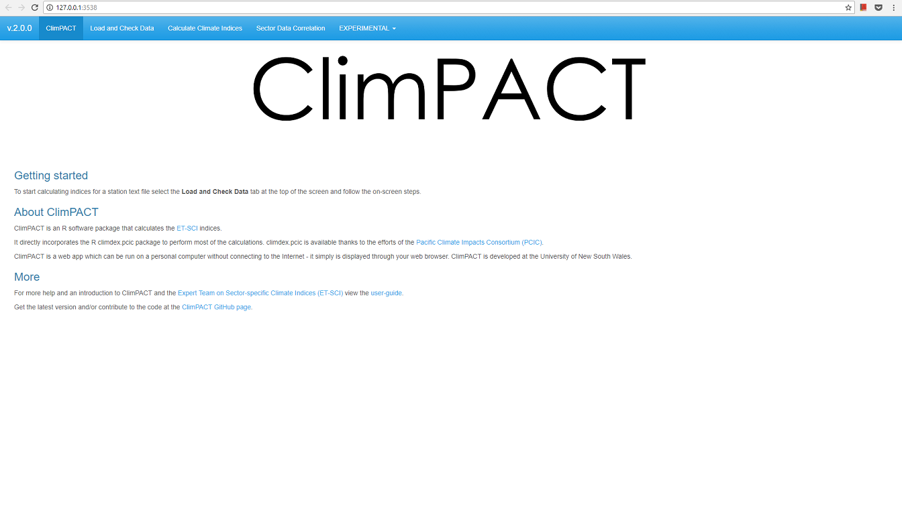
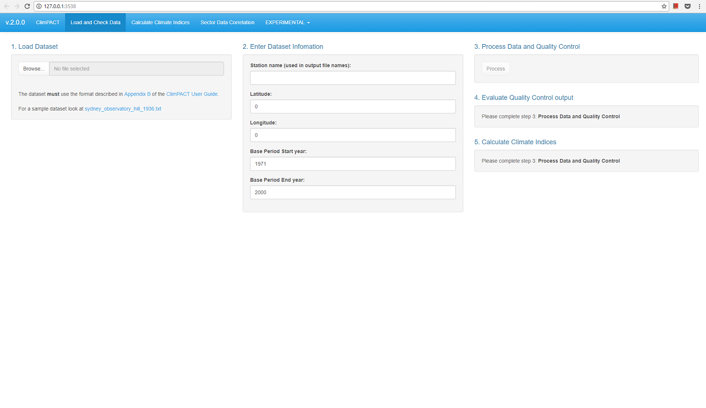
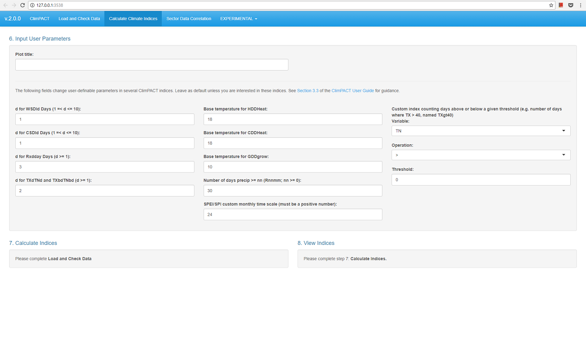

<a name="toc"></a>
# Climpact user guide

Visit the Climpact [website](https://climpact-sci.org/) and [Github repository](https://github.com/ARCCSS-extremes/climpact) to find out more about this project.

## Table of contents

1. [Acknowledgements](#acknowledgements)
1. [Background to Climpact](#background)
1. [Getting and installing Climpact locally](#gettinginstalling)
1. [Calculating the indices from a single station text file](#calculate_single_station)
1. [Calculating the indices from multiple station text files](#calculate_multi_station)
1. [Output for station text files](#outputstation)
1. [Calculating the indices from netCDF files](#calculatenetcdf)
1. [Output for netCDF files](#outputgridded)

[*Appendix A*: Table of Climpact indices](#tableofindices)
<br>
[*Appendix B*: Formatting of input files](#formattinginput)
<br>
[*Appendix C*: Quality control (QC) diagnostics](#qc)
<br>
[*Appendix D*: Percentile calculations](#percentilecalc)
<br>
[*Appendix E*: Heatwave and coldwave calculations](#heatcoldwaves)
<br>
[*Appendix F*: FAQ](#faq)
<br>
[*Appendix G*: Software license agreement](#licence)


<a name="acknowledgements"></a>
## Acknowledgements
[RETURN TO TOP](#toc)

* Climpact was made possible by the WMO Commission for Climatology (CCl) Open Panel of Experts on Climate Information for Adaptation and Risk Management (OPACE 4) under the guidance of OPACE-4 co-chairs (Rodney Martinez and Andrew Tait); the CCl OPACE 4 Expert Team on Sector-specific Climate Indices (ET-SCI) members: Lisa Alexander (Chair, Australia), Toshiyuki Nakaegawa (co-Chair, Japan), Fatima Zohra El Guelai (Morocco), Amelia Diaz Pablo (Peru), Adam Kalkstein (USA) and Gé Verver (The Netherlands) and the WMO World Climate Applications and Services Programme (Rupa Kumar Kolli and Anahit Hovsepyan). 

* Climpact and its associated material draws heavily on the input of the Expert Team on Climate Risk and Sector-specific Climate Indices (ET-CRSCI), the ET-SCI that succeeded it and including additional ET-CRSCI members Elena Akentyeva, Alexis Nimubona, G. Srinivasan, Philip Thornton, and Peiqun Zhang. Significant contributions to the development of the Climpact indices, software and documentation also came from Jonathan McComb, Nicholas Herold, Nicholas Hannah, Enric Aguilar, Andrew King, James Goldie, Brad Rippey, Sarah Perkins, Sergio M. Vicente-Serrano, Juan Jose Nieto, Sandra Schuster and Hongang Yang. Input was also provided by James Hiebert of PCIC. We are also grateful to the other experts and sector representatives who have contributed to the development of indices: Manola Brunet, Albert Klein Tank, Christina Koppe, Sari Kovats, Glenn McGregor, Xuebin Zhang, Javier Sigro, Peter Domonkos, Dimitrios Efthymiadis.

* Climpact uses the R packages [climdex.pcic](https://pacificclimate.github.io/climdex.pcic/) and [climdex.pcic.ncdf](https://pacificclimate.github.io/climdex.pcic.ncdf/) as its core. These packages were developed by the Pacific Climate Impacts Consortium (PCIC).

* The application of climate indices to the Agriculture sector was undertaken in full cooperation with the WMO Commission for Agricultural Meteorology, through which Brad Rippey and Sergio Vicente Serrano supported the work.

* Commission for Climatology experts Glenn McGregor, Christina Koppe and Sari Kovats supported the applications of indices for Climate and Health, in particular for heat waves and health.

* Climpact is written in the R programming language and makes use of numerous third party R packages. R is available as Free Software under the terms of the Free Software Foundation's GNU General Public License in source code form.

* This work has also been historically supported by WMO grant SSA 3876-12/REM/CNS and Australian Research Council grants CE110001028... and through funding from the New South Wales Office of the Environment and Heritage. 


<a name="background"></a>
## Background
[table of contents](#toc)

This document was prepared on behalf of the World Meteorological Organization (WMO) Commission for Climatology (CCl) Expert Team on Sector-specific Climate Indices (ET-SCI). It outlines the background and goals of the ET-SCI and describes the indices and software that were developed on their behalf.

The ET-SCI, formerly known as the Expert Team on Climate Risk and Sector-specific Indices (ET-CRSCI) was set up by the Fifteenth session of the WMO Technical Commission for Climatology (CCl-XV, Antalya, Turkey, February 2010), with terms of reference established to support eventual implementation of the Global Framework for Climate Services (GFCS). Following the sixteenth World Meteorological Congress in May 2011 where a decision was made by WMO members to implement the GFCS, the ET-SCI held their first meeting in Tarragona, Spain (13-15 July, 2011).

 

### 1.1 Role of ET-SCI in GFCS

The ET-SCI sits within CCl under the Open Panel of CCl Experts (OPACE) on Climate Information for Adaptation and Risk Management (OPACE-4). The objective of OPACE-4 is to improve decision-making for planning, operations, risk management and for adaptation to both climate change and variability (covering time scales from seasonal to centennial) and will be achieved through a higher level of climate knowledge, as well as by access to and use of actionable information and products, tailored to meet their needs. OPACE-4 activities primarily focus on the development of tailored climate information, products and services for user application in adaptation and risk management, and building interfaces with user groups to facilitate GFCS implementation.


The work of OPACE-4 is multidisciplinary, and requires close collaboration with experts from various socio-economic sectors. In keeping with the priorities agreed for initial implementation of the GFCS, the core priority sectors for consideration by the OPACE in this present intersessional period are agriculture/food security, water and health. This requires close collaboration with relevant experts in these sectors including seeking guidance and aid from the WMO Technical Commissions for Agricultural Meteorology (CAgM) and Hydrology (CHy) and with the World Health Organisation (WHO).


The ET-SCI Terms of Reference (ToR) and expected deliverables are shown in Appendix H. The deliverables include the collection and analysis of existing sector-relevant climate indices in addition to developing the tools required to produce them. At a meeting in Tarragona in 2011, members of the former ET-CRSCI invited sector and Commission representatives to help define a suite of indices that would represent a “core set” that would meet the ToR and deliverables. This manual outlines the rationale behind the creation of those indices and the Climpact software developed for their calculation.

      

### 1.2 The ‘value’ of climate indices

Monthly averages of climate data smooth over a lot of important information that is relevant for sectoral impacts. For this reason indices derived from daily data are an attempt to objectively extract information from daily weather observations to answer questions concerning aspects of the climate system that affect many human and natural systems with particular emphasis on extremes. Such indices might reflect the duration or amplitude of heat waves, extreme rainfall intensity and frequency or measures of extremely wet or dry/hot or cold periods that have socio-economic impacts. Climate indices provide valuable information contained in daily data, without the need to transmit the daily data itself.


Much progress has been made in recent decades through internationally agreed indices derived from daily temperature and precipitation that represent more extreme aspects of the climate, overseen by the CCl/WCRP/JCOMM Expert Team on Climate Change Detection and Indices (ETCCDI). Development and analyses of these indices has made a significant contribution to the Intergovernmental Panel on Climate Change (IPCC) Assessment Reports.

 

### 1.3 Background to ETCCDI, Indices and Software

The ETCCDI started in 1999 and is co-sponsored by the World Climate Research Program (WCRP) and JCOMM. They developed an internationally coordinated set of core climate indices consisting of 27 descriptive indices for moderate extremes (Alexander et al. 2006; Zhang et al. 2011). These indices were developed with the ‘detection and attribution’ research community in mind. In order to detect changes in climate extremes, it was important to develop a set of indices that were statistically robust, covered a wide range of climates, and had a high signal-to-noise ratio. In addition, internationally agreed indices derived from daily temperature and precipitation allowed results to be compared consistently across different countries and also had the advantage of overcoming most of the restrictions on the dissemination of daily data that apply in many countries.


ETCCDI recognized that a two-pronged approach was needed to promote further work on the monitoring and analysis of daily climate records to identify trends in extreme climate events (Peterson and Manton, 2008). In addition to the formulation of indices described above, a second prong was to promote the analysis of extremes around the world, particularly in less developed countries, by organizing regional climate change workshops that provided training for the local experts and conducted data analysis. The goals of these workshops are to: contribute to worldwide indices database; build capacity to analyse observed changes in extremes; improve information services on extremes in the region; and publish peer-reviewed journal articles. Most of these articles were directly a result of the regional workshops and included all of the workshop participants as authors (e.g. Peterson et al. 2002; Vincent et al. 2005; Zhang et al. 2005; Haylock et al. 2006; Klein Tank et al. 2006; New et al. 2006; Aguilar et al, 2006, Aguilar et al. 2009; Caesar et al. 2011; Vincent et al. 2011).


As part of the workshop development, software called RClimDEX was also developed that could be used at the workshops (thus providing consistent definitions from each workshop and region). Environment Canada provides, maintains, and further develops the R-based software used for the workshops (freely available from http://etccdi.pacificclimate.org/software.shtml).

 

### 1.4 Background to Development of ET-SCI Indices

Most ETCCDI indices focus on counts of days crossing a threshold; either absolute/fixed thresholds or percentile/variable thresholds relative to local climate. Others focus on absolute extreme values such as the warmest, coldest or wettest day of the year. The indices are used for both observations and models, globally as well as regionally, and can be coupled with simple trend analysis techniques, and standard detection and attribution methods in addition to complementing the analysis of more rare extremes using Extreme Value Theory (EVT).


One current disadvantage of the ETCCDI indices is that few of them are specifically sector-relevant. While some of these indices may be useful for sector applications (e.g. number of days with frost for agricultural applications, heat waves for health applications) it was realised that it was important to get sectors involved in the development of the ET-SCI indices so that more application-relevant indices could be developed to better support adaptation.


The core set of indices agreed by the ET-SCI (as the ET-CRSCI) at their meeting in Tarragona, Spain in July 2011 were developed in part from the core set of indices that are developed and maintained by ETCCDI. The meeting included technical experts in climate and health and climate and agriculture from CCl and CAgM and it was agreed that the initial effort should consider requirements for climate indices relevant to heat waves and droughts. A core set of 34 indices was agreed at that meeting. In some cases these indices are already part of the core set defined by the ETCCDI. All indices calculated by Climpact are shown in Appendix A and are separated into core and non-core ET-SCI indices. In addition, there is some scope in the Climpact software for the user to create their own index based on absolute thresholds.


It should be noted that indices development is an ongoing activity as additional sector-needs arise and other sectors are considered within the Terms of Reference and deliverables of the ET-SCI. This softwrae and documentation should therefore be seen only as the initial step in the continuing work of the ET-SCI.

 

### 1.5 Requirements for data quality when computing indices

Before indices can be computed, it is important that any daily input data are checked for quality and homogeneity. Homogeneity implies consistency of a series through time and is an obvious requirement for the robust analysis of climate time series. While many of the time series that are used for indices calculations have been adjusted to improve homogeneity, some aspects of these records may remain inhomogeneous, and this should be borne in mind when interpreting changes in indices. For example, most methods for assessing homogeneity do not consider changes in day-to-day variability or changes in how the series has been derived. It is possible for a change of variance to occur without a change in mean temperature. Two examples of ways in which this could occur are where a station moves from an exposed coastal location to a location further inland, increasing maximum temperatures and decreasing minimum temperatures, or where the number of stations contributing to a composite series changes.


Homogeneity adjustment of daily data is difficult because of high variability in the daily data when compared with monthly or annual data, and also because an inhomogeneity due to a change in station location or instrument may alter behaviour differently under different weather conditions. Homogeneity adjustment of daily data is a very active field of research and there are many methods which could be used. Although many different methods exists, the ETCCDI promote the use of the RHTest software because it is free and easy to use, making it ideal for demonstration in regional workshops. The software method is based on the penalized maximal t (PMT) or F test (PMF) and can identify, and adjust for, multiple change points in a time series (see Wang, 2008 and ETCCDI software website for more details). PMT requires the use of reference stations for the homogeneity analysis but PMF can be used as an absolute method (i.e. in isolation or when there are no neighbouring stations to use for comparison)*. In Climact, apart from basic quality control, there is currently no means to homogenise data. We therefore assume that the required level of homogeneity testing and/or adjustment has already been applied. 


*NB Daily adjustments, especially with absolute methods, must be applied with extreme care as – if incorrectly applied – they can damage the statistical distribution of the series. Therefore, data require careful post-workshop analysis in concert with metadata (where available) and as such ET-SCI recommend that any homogeneity software used at regional workshops is for demonstration purposes only.


 

### 1.6 Future prospects for the Indices

At present the core set of indices are defined using only daily maximum temperature (TX), daily minimum temperature (TN) and daily precipitation (PR). It is acknowledged that for sector applications, these variables (and the related indices) are all required, but users have also indicated a need for additional variables including: humidity (important for both agricultural and health indices); wind speed and direction (important for health indices, building design, energy, transportation, etc.); Sea Surface Temperatures (SSTs; useful for marine applications and in relation to the onset and variability of the El Niño-Southern Oscillation (ENSO)); onset and cessation dates for monsoon; rain periods, snow fall, snow depth, snow-water equivalent, days with snowfall and hydrological parameters (particularly important for mid-and high latitude applications). Some of these (e.g. onset dates) may require considerable study and available systematic long-term data. Furthermore, in a subsequent phase of the work of the Team, addition of ‘event statistics’ such as days with thunderstorms, hail, tornados, number of consecutive days with snowfall, etc., for expanded studies of hazards could be considered. The ET-SCI will consider at a later date whether to add these new variables to the dataset as a second level priority.


The ET-SCI also feels that it is important to add several complex indices to this initial effort (for example heat waves), but recognized that more could be demanded by (or may be in current use by) sectors, once they are consulted on the process and through training. The development of indices to assess multi-day temperature extremes (e.g., prolonged heat waves) has been particularly challenging, as the occurrence of such events depends not just on the frequency distribution of daily temperatures, but also on their persistence from day to day. The existing ETCCDI indices measure the maximum number of consecutive days during events with six or more consecutive days above a specified percentile value or anomaly, vary widely in frequency across climates, describe events that occur rarely or not at all in many climates, and are poor discriminators of very extreme events. The ET-SCI are therefore recommending some new heat wave indices (see Appendix D) that have been added as a supplement to the core set in this initial phase of the software. This range of indices is defined for most climates and has a number of other desirable statistical properties, such as being approximately normally distributed in many climates.


Also drought indices have been included following ET-SCI recommendations. Since drought severity is difficult to quantify and is identified by its effects or impacts on different types of systems (e.g. agriculture, water resources, ecology, forestry, economy), different proxies for drought have been developed based on climatic information. These are assumed to adequately quantify the degree of drought hazard exerted on sensitive systems. Recent studies have reviewed the development of drought indices and compared their advantages and disadvantages (Heim, 2002; Mishra and Singh, 2010; Sivakumar et al., 2010). Currently Climpact includes the Standardized Precipitation Index (SPI), proposed by McKee et al. (1993), and accepted by the WMO as the reference drought index for more effective drought monitoring and climate risk management (World Meteorological Organization, 2012), and the Standardized Precipitation Evapotranspiration Index (SPEI), proposed by Vicente-Serrano et al. (2010), which combines the sensitivity to changes in evaporative demand, caused by temperature fluctuations and trends, with the simplicity of calculation and the multi-temporal nature of the SPI.


In a subsequent phase, ET-SCI will investigate additional complex indices combining meteorological variables (e.g. temperature and humidity for physiological comfort), and could consider indices that combine meteorological/hydrological parameters with sector-based information including measures of vulnerability.


Much of the input for additional indices will come from regional workshops with participants from both National Meteorological and Hydrological Services (NMHSs) and sector groups. The ET-SCI will work with sector-based agencies and experts, including those of relevant WMO Technical Commissions, particularly the Commission for Climatology for health, the Commission for Hydrology (CHy) for water and the Commission for Agricultural Meteorology (CAgM) for agriculture and food security, to facilitate the use of climate information in users’ decision-support systems for climate risk management and adaptation strategies. As part of this development, the ET-SCI commissioned the development of Climpact with the aim of producing an easy and consistent way of calculating indices for each user, with regional workshop users particularly in mind. To date workshops have been held in Ecuador, Fiji, Barbados and India. An example of an ET-SCI workshop can be found here.


It is also acknowledged that updating indices is problematic for many regions and some regions would need specific indices to cope with their particular needs to provide climate services. As GFCS stresses the importance of the global, regional and local scales, the ET-SCI acknowledges that support for this could come from Regional Climate Centers (RCCs) or Regional Climate Outlook Forums (RCOFs) etc. In addition, there are constraints on access to daily data. It is a considerable challenge to assemble worldwide datasets which are integrated, quality controlled, and openly and easily accessible. There is tension between traceability (access to the primary sources) and data completeness (use whatever available). Also a problem arises through the use of specified climatological periods which vary from group to group and which are used for base period calculations for percentile-based indices. In the first iteration of the software we use the base period of 1971-2000 but recognise that this will need to be amended for countries that do not have records covering this period. The software has been written in such a way that the user can specify the climatological base period which is most suitable for their data.


Users are invited to view Climpact as ‘living software’ in that it can and will be amended as additional user needs arise.

<a name="gettinginstalling"></a>
## Getting and installing Climpact
[RETURN TO TOP](#toc)

To calculate the Climpact indices for station data the user may go to the [Climpact website](https://climpact-sci.org/). This section describes the process of downloading and installing Climpact locally, for users who wish to calculate the indices on gridded data, or on station data using their own computer. Calculation of the Climpact indices on gridded data requires a Linux or MacOS system.

The following sections describe the software requirements and the process of downloading and installing Climpact locally. 

### 3.1 Software requirements
* [R](https://cran.r-project.org/) version 3.3 or higher.
* A modern web browser. Note that while a web browser is required to use Climpact locally, once it is installed an internet connection is **not** required.
* For calculation of gridded indices:
    * a Linux or MacOS operating system
    * the PROJ4 development files (libproj-dev package on Ubuntu)
    * the udunits development files (libudunits2-dev package on Ubuntu)

See the video below for a demonstration of installing R in Windows 10.

[](http://www.youtube.com/watch?v=a-vnLME6hRQ "")

### 3.2 Getting Climpact

Climpact can be downloaded from the [Github website](https://github.com/ARCCSS-extremes/climpact). The latest version can be downloaded as a zip file from [this link](https://github.com/ARCCSS-extremes/climpact/archive/master.zip). Download and extract the contents of this file. This will create a directory called climpact-master. 

### 3.3 Installing Climpact

Once you have installed R and downloaded and extracted Climpact onto your computer you will need to install Climpact. This process involves installing the R packages that Climpact requires and only need to be completed once. Watch the video below for a demonstration of installing Climpact in Windows 10, or follow the steps outlined below.

**In Windows** open R and select *File->Change dir...* and select the *climpact-master* directory created in section 2.2. Then at the R command line type ```source('installers/climpact.master.installer.r').```

**In Linux and MacOS** open a terminal window and change to the *climpact-master* directory created in section 2.2, then open R in the terminal window by typing ```R``` and then type ```source('installers/climpact.master.installer.r').```

The above process will start downloading and installing the R packages that Climpact requires. This process can take several minutes but will only need to be completed once. If this is the first time you are installing R packages you will be prompted to select a "mirror", these are geographical locations of servers around the world and you should typically select the mirror closest to your location (see figure below). You may select any location, though the closest location will usually offer the fastest download speed. Once complete, you should see a message in the R console saying ```Checking complete.```.


<a name="calculatestation"></a>
## 4. Calculating the indices from a station text file
[RETURN TO TOP](#toc)

### 4.1 Starting Climpact

Climpact can calculate climate extremes indices for a single location using data stored in a text file, or for a gridded dataset using data stored in a netCDF file. This section of the user guide describes how to calculate the Climpact indices for a single location text file (usually a weather station). It is imperative that your text file is formatted according to the guidelines in [Appendix B](#appendixb).

In Windows, open R and select *File->Change dir...* and select the *climpact-master* directory created when installing Climpact (see [Section 2](#gettinginstalling) if you have not done this). Then run the following two commands;
```r
library(shiny)
runApp()
```

In Linux or MacOS, cd to the *climpact-master* directory created instep 1, then open R in a terminal window (by typing ```R```) and run the following two commands;
```r
library(shiny)
runApp()
```

Climpact should then start in your web browser. And you should see the home page as pictured below. From here you can follow the on-screen information to calculate the indices, or continue reading.



### 4.2 Load data

Different functionality in Climpact is accessed via the tabs on the left of the screen. From the home page select the *Process single station* to begin calculating the indices on a station text file. You should see the following screen which shows 4 tabs at the top of the screen highlighting the steps to calculate the indices and their correlation to any sector data the user has (this last step is optional).

The first step is to load your text file into Climpact. To do this, select *Browse* and upload your station file to Climpact. **NO STATION DATA IS STORED BY CLIMPACT AFTER YOU LEAVE THE SITE.**

After selecting your station file, enter the following station information:
* **Name**: Name of your station if the default is incorrect.
* **Latitude**: a decimal value between -90 and 90.
* **Longitude**: a decimal value between -180 and 180.
* **Base period start year**: the beginning of the period of time on which you would like percentile thresholds to be based (e.g. if you want your base period to be 1961-1990, enter 1961 here). Confused by what this is for? See [Appendix D](#appendixd).
* **Base period end year**: the end of the period of time on which you would like percentile thresholds to be based (e.g. if you want your base period to be 1961-1990, enter 1990 here). Confused by what this is for? See [Appendix D](#appendixd).

Once the above information is entered select the *Next* button at the bottom of the screen which will bring you to tab 2.




### 4.2 Check data

Tab 2 


### 4.3 Calculate climate indices

On this screen you are required to enter information relating to the indices that will be calculated.



* Box 6: Enter the title that will appear on each plot. You may also change the following default parameters that relate to several indices (see Appendix A for index definitions);

    * **WSDId Days** sets the number of days which need to occur consecutively with a TX > 90th  percentile to be counted in the WSDId index.

    * **CSDId Days** sets the number of days which need to occur consecutively with a TN < 10th  percentile to be counted in the CSDId index.

    * **RxdDay Days** sets the monthly maximum consecutive d-day precipitation to be recorded by the Rxdday index.

    * **d for TXdTNd and TXbdTNbd** sets the number of consecutive days required for the TXdTNd and TXbdTNbd indices.

    * **base temperature** for HDDheat, CDDcold and GDDgrow set the temperatures to be used in calculating these indices.

    * **Number of days where precipitation >= nn (Rnnmm)** allows the user to calculate the number of days with precipitation greater than or equal to a set amount. This index will be called ‘rnnmm’, where ‘nn’ is the precipitation set by the user.

    * **Custom day count index** gives the user the option to create their own index based on the number of days crossing a specified threshold for daily maximum temperature (TX), minimum temperature (TN), diurnal temperature range (DTR) or precipitation (PR). To calculate a custom index, the user must select one of these variables, an operator (<,<=,>,>=) and a constant. For example, selecting TX, the ‘>=’ operator and specifying ‘40’ as a constant will calculate an index representing the number of days where TX is greater than or equal to 40°C. Climpact will output this index as TXge40. Operators are abbreviated in text with lt, le, gt and ge for <, <=, > and >=, respectively.

* **Box 7**: Once you have reviewed the above parameters, select the 'Calculate indices' button. A progress bar will appear in the lower right corner. This process can take up to a minute depending on the length of your record and the speed of your computer.

* **Box 8**: Once Climpact has finished calculating the indices you will be presented with the directory path where your output has been created. In this directory you will find several subdirectories including plots, indices, trend, thres and qc. The plots subdirectory contains image files with plots of each index. The indices subdirectory contains .csv files with the data for each index. The trend subdirectory contains a .csv file with linear trend information calculated for each index. The thres subdirectory contains two files with threshold information used in calculating the indices. The qc subdirectory contains the quality control diagnostic information calculated in section 3.2. See section 3.5 for more information on Climpact output.

**At this point** the calculating of the indices is complete. If you would like to also calculate the correlation between some sector data you have and the indices that have been calculated, you may proceed to the next section describing 'Sector Data Correlation'.


### 4.4 Sector Data Correlation

Climpact can calculate and plot correlations between annual sector data the user has and the indices it has calculated. Use the 'Sector Data Correlation' tab after you have calculated your indices to do this. Currently, Climpact only calculates correlations for annual sector data. Note that the indices must have been calculated in the current session of Climpact. So, if you have closed Climpact and wish to calculate correlations with sector data, you must repeat the process described in sections 3.2 and 3.3.

Box 9: Select sector data file for correlating with indices. See Appendix B for guidance on formatting this file.

Box 10: Select a name for your sector data and whether you would like the sector and index data to be detrended prior to calculating the correlations.

Box 11: Once you have selected your data and chosen a name for your data, select the 'Calculate correlations' tab.

Box 12: Once complete, you will be provided with a link to plots and .csv files containing the correlations.

<a name="calculate_multi_station"></a>
## 5. Calculating indices for multiple station text files


<a name="outputstation"></a>
## 6. Output for station text files

When calculating indices on station text files Climpact creates six sub-directories at *climpact-master/www/output/[station_name]*, where [station_name] is the name you entered on the 'Load' tab in section X.Y. The sub-directories created are listed in the table below and will contain files if [all four steps](#calculatestation) for calculating the indices on a station text file are completed. The subsections that follow describe the output found in these six folders.

|Output folder name|Description|
|---------|-------|
|indices|Stores .csv files for each index calculated|
|plots|Stores image files containing plots of each index|
|qc|Stores quality-control information calculated in step 2 of the [index calculation process](#calculatestation)|
|thres|Stores two .csv files containing threshold information|
|trend|Stores a .csv file containing trend information for each index|

### 6.1 Quality control
***PREFACE****: The text in this section is adapted from text written by Enric Aguilar and Marc Prohom for the R functions they created to perform quality control, which have been integrated into Climpact with their permission.*

Quality control (QC) diagnostics are only calculated for station text files (i.e. they are NOT calculated for netCDF files). While the QC checks performed by Climpact are reasonably extensive, they do not guarantee that all errors will be detected. Furthermore, a separate category of QC issues, that of homogeneity, often occurs in station data and Climpact does not check for this. Thus it is advised that, if the user is analysing observations (as opposed to model data) that they be sure of the quality of their data before using Climpact, or, that they utilise additional checks for homogeneity after running the QC checks performed by Climpact (and described in this section). [RHtests](http://etccdi.pacificclimate.org/software.shtml) is one program that performs homogeneity tests. It is freely available, easy to use and is also built on the R programming language.

Below is a seminar on the QC functionality described in this section.

[](http://www.youtube.com/watch?v=gusIge2bTNk "")


#### 6.1.1 Overview of the quality control output

Once the user selects the *Check* button under tab 2 (see [section 4](#calculatestation)) Climpact will calculate thresholds and perform QC checks on the user-provided station file. At the end of this process a dialogue box will appear telling the user to check the *qc* sub-directory created in *climpact-master/www/output/[station_name]*.

The *qc* folder contains the following files (where “mystation” refers to the name of the user’s station file):

**7 .pdf files**, with graphical information on data quality:
<br>
mystation_tminPLOT.pdf
<br>
mystation_tmaxPLOT.pdf
<br>
mystation_dtrPLOT.pdf
<br>
mystation_prcpPLOT.pdf
<br>
mystation_boxes.pdf
<br>
mystation_boxseries.pdf
<br>
mystation_rounding.pdf


**9 .csv files** with numerical information on data quality

mystation_duplicates.csv

 mystation_outliers.csv

 mystation_tmaxmin.csv

mystation_tx_flatline.csv

mystation_tn_flatline.csv

mystation_toolarge.csv

mystation_tx_jumps.csv

mystation_tn_jumps.csv

mystation_temp_nastatistics.csv

 

C.2 File descriptions 

mystation_tminPLOT.pdf

mystation_tmaxPLOT.pdf

mystation_dtrPLOT.pdf

mystation_prcpPLOT.pdf

 

These files contain simple plots of the daily time-series of minimum temperature, maximum temperature, diurnal temperature range and precipitation, respectively. This allows the user to view the data and identify obvious problems by eye such as missing data (indicated by red circles) or unrealistic values.

Below is an example for tmax.

tmax

mystation_boxes.pdf

 

This file identifies potential outliers based on the interquartilic (IQR). The IQR is defined as the difference between the 75th (p75) and the 25th (p25) percentiles. As can be seen in the example below, the mystation_boxes.pdf file contains boxplots of temperature and precipitation data flagging as outliers (round circles) all those temperature values falling outside a range defined by p25 – 3 interquartilic ranges (lower bound) and p75 + 3 interquartilic ranges (upper bound). For precipitation, 5 IQR are used.


 

The values identified by this graphical quality control, are sent to a .csv file, mystation_outliers.csv. This file lists the outliers grouped under the variable that produced the inclusion of the record in the file and specifying the margin (upper bound or lower bound) that is surpassed. So, under ‘Prec up’ appear those values that represent a precipitation outlier; under ‘TX up’ are those that represent a maximum temperature higher than p75+3*IQR; under ‘TX low’ are outliers that represent an observation lower than p25-3*IQR. The explanation given for TX, also applies to TN and DTR. The advantage of this approach is that the detection of this percentile based outliers is not affected by the presence of larger outliers, so ONE RUN OF THE PROCESS IS ENOUGH.

 

Date    Prec     TX       TN       DTR

Prec up                                               

2/01/1951        31.8     14.3     10.2     4.1

12/01/1961      47.5     23.4     11.4     12

5/04/1963        42.8     19.2     13.6     5.6

18/04/1967      29.1     20.2     11.8     8.4

19/04/1969      28.2     27.7     17.9     9.8

19/04/1973      53.6     14.8     11.1     3.7

21/11/1991      55.9     11.4     7.8       3.6

11/11/1995      32.1     18.4     13.5     4.9

1/12/2000        31.6     18.6     12.6     6

31/12/2001      32.1     16        9.4       6.6

15/12/2005      30.2     22.1     13.3     8.8

TX up                                     

TX low                                               

TN up                                     

TN low                                               

30/10/1972      2.5       -11.2    -23.4    12.2

31/10/1972      4.3       -4.8      -24.8    20

DTR up                                              

DTR low                                            

 

mystation_boxseries.pdf

 

The graphic file boxseries.pdf (which does not have a numerical counterpart) produces annual boxplots. This file is useful to have a panoramic view of the series and be alerted of parts of the series which can be problematic (see values around 1984 in the example figure below).


mystation_rounding.pdf

This file looks at rounding problems by plotting the frequency of values after each decimal point. It shows how frequently each of the 10 possible values (.0 to .9) appears. It is expected that .0 and .5 will be more frequent (although there is no statistical reason for this!).


mystation_tn_flatline.csv

mystation_tx_flatline.csv

 

The mystation_tn_flatline.csv and mystation_tx_flatline.csv files report occurrences of 4 or more equal consecutive values in, respectively, TX and TN. A line for each sequence of 4 or more consecutive equal values is generated. In the example below all sequences are 4 values long (i.e. each corresponding value has been repeated 3 extra times). The date specified belongs to the end of the sequence.

 

Date    TX       Number of duplicates

4/09/1937        18        3

28/11/1937      16.9     3

 

Looking at the data, the first sequence identified by the QC test is shown below.

 

1937    9          1          0          16.4     11.6

1937    9          2          0          18        10.2

1937    9          3          0          18        8.6

1937    9          4          0          18        7

 

mystation_duplicates.csv

 

The file mystation_duplicates.csv includes all dates which appear more than once in a datafile. In the listing below, one can see that 1958/08/26 occurs twice, and thus will be reported in mystation_duplicates.csv.

 

1951 8 24

1951 8 25

1951 8 26

1951 8 26

1951 8 28

1951 8 29

1951 8 30

1951 8 31

 

mystation_toolarge.csv

 

The file mystation_toolarge.csv reports precipitation values exceeding 200 mm (this and any other threshold can be easily reconfigured before execution) and temperature values exceeding 50 ºC.

 

mystation_tx_jumps.csv

mystation_tn_jumps.csv

 

The files mystation_tx_jumps.csv and mystation_tn_jumps.csv will list those records where the

temperature difference with the previous day is greater or equal than 20 ºC.

 

mystation_tmaxmin.csv

 

The mystation_tmaxmin.csv file, records all those dates where maximum temperature is lower than minimum temperature.

 

mystation_temp_nastatistics.csv

 

This file lists the number of missing values that exists for each variable (TX, TN, PR) for each year.

 


### 6.2 Climpact indices and plots

Climpact produces two key subdirectories where the results of each index are stored, *plots* and *indices*. For each index one image file (.png) containing a plot of the index and one comma-separated value file (.csv) containing the index values are created and put into the the *plots* and indices* subdirectories, respectively. The .csv files can be opened in Microsoft Excel, Open Office Calc or a text editor. The index files have filenames “sydney_XXX_YYY.csv” where XXX represents the name of the index (see [Appendix A](#appendixa)) and YYY is either ANN or MON depending on whether the index has been calculated annually or monthly, respectively. A sample .csv file for the index *su* is shown below. There is one value for each year the index is calculated. For indices calculated monthly there will be one value per month. A column containing normalised values is also written for most indices (these values are normalised using all available years/months). Note that for any years or months where insufficient data exists, the missing value of -99.9 will be used.


An example plot for the index *su* is shown below. These files may be opened in any standard image viewing software. The Sen's slope is displayed at the bottom of the plot along with the lower and upper bounds of the 95% confidence interval (these are calculated with the [zyp](https://cran.r-project.org/web/packages/zyp/index.html) package in R). In addition, one .pdf file ending in \*_all_plots.pdf, is produced in the subdirectory plots/. This file contains all plots.

See [Appendix A](#appendixa) for definitions of each Climpact index.


### 6.3 Sector data
Climpact can also calculate basic statistics between the climate extremes indices and user-provided sector data. Refer to [section 4](#) for instructions on calculating these sector statistics. Refer to [Appendix B](#appendixb) for guidance on how sector data must be formatted. Currently, the sector data must be annual. 

Specifically, Climpact calculates correlations between each index and the user's sector data, as well as regressions of the sector data onto the minimum, maximum and average daily temperatures.

Below is an example of the bar chart produced which shows the correlation coefficient between Climpact indices and sector data. Precipitation-related indices are represented by blue bars and temperature-related indices by red bars.


Below is an example of a regression plot between maximum temperature and sector data. Whether the variable being regressed onto is the daily minimum, maximum or average, all of this data is averaged annually in order to perform the regression.


<a name="calculatenetcdf"></a>
## 7. Calculating the indices from netCDF files
[RETURN TO TOP](#toc)

Users who have three-dimensional netCDF datasets (time x latitude x longitude) of daily temperature and precipitation may also calculate the Climpact indices. Currently, there are two ways to do this. Firstly, users may utilise the separate Climpact.ncdf.wrapper.r script and optionally the Climpact.ncdf.thresholds.wrapper.r script by modifying them and executing them from the Windows or Linux command line. This functionality is intended for users familiar with R and/or the command line. Secondly, there is an experimental user interface to this functionality which can be accessed via the 'EXPERIMENTAL' tab that can be seen upon starting Climpact. While this uses the same code to calculate the indices as the above mentioned wrapper scripts, there are several instabilities in the Climpact user interface that result from errors that occur during calculation not being handled well by Climpact. Thus, unless you are confident your data is formatted correctly it is only recommended that users use the wrapper scripts.

See Appendix B about ensuring your data is in the correct format. If it is not in the correct format, there may be unintended and non-obvious consequences.

### 7.1 Using the netCDF wrapper scripts

The Climpact.ncdf.wrapper.r script calculates the Climpact indices on the given netCDF file(s). To use this script, make a copy of it and edit the parameters inside according to your data (the comments in this file will guide you in determining how to change these variables). It is important that you make a copy of this file and do not alter the original. As a test, it is recommended to run this script on the provided sample data BEFORE running on your own data.

If you wish to calculate the indices for data contained in one set of netCDF files, however using percentile thresholds based on data in another set of netCDF files, then the Climpact.ncdf.thresholds.wrapper.r will need to be used.

A typical example of this follows.

The user has a netCDF file containing model simulated daily precipitation, maximum temperature and minimum temperature for the present day period of 1990 - 2010. The user also has a netCDF file containing climate model projections for the period 2050 - 2070. They wish to calculate the Climpact indices on both of these periods but want the percentile-based indices in both periods (present and future) to utilise thresholds calculated from the present day climate. For a brief explanation of climate indices including thresholds-based indices refer to Appendix F (Wait, what is a climate index?).

To complete the above scenario requires three steps:

1. Make a copy of Climpact.ncdf.wrapper.r and modify it to point to the present day netCDF files, specifying your desired base period. In the above example this might be 1990 - 2000 (your base period does NOT have to cover the entire range of your data). Run this script from the command line using Rscript Climpact.ncdf.wrapper.COPY1.r

2. Make a copy of Climpact.ncdf.thresholds.wrapper.r and modify it to point to the same present day netCDF files used as input in step 1. Here the user needs to specify the same base period, e.g. 1990 - 2000. Run this script from the command line using Rscript Climpact.ncdf.thresholds.wrapper.COPY.r. The output of this will be a single netCDF file containing threshold values. Note step 1 and 2 can technically be done in any order, step 2 is only required in order to complete step 3.

3. Make another copy of Climpact.ncdf.wrapper.r and modify it to point to the future climate netCDF files, specifying a base period consistent with the above steps (e.g. 1990 - 2000) but this time specify the threshold file that was claculated in step 2 above. Run this script from the Linux command line using Rscript Climpact.ncdf.wrapper.COPY2.r

These scripts typically take many hours to run (however, runtime varies strongly based on input file size and computer resources). Once you have run Climpact.ncdf.wrapper.r, numerous netCDF files will exist in the output directory specified. Where relevant, indices are calculated at both monthly and annual time scales. A typical output file name is r20mm_ETCCDI_ANN_climpact.sample_historical_NA_1991-2010.nc, where r20mm refers to the index calculated and ANN refers to the time scale this index was calculated on (MON for monthly). Output file names are dervied from the CMIP5 conventions and follow this format var_timeresolution_model_scenario_run_starttime-endtime.nc.

### 7.2 Calculating gridded indices via the Climpact user-interface

This functionality is experimental.

Start Climpact. In Windows, open R and select File->Change dir... and select the climpact-master directory created when installing Climpact (see Section 2 if you have not done this). Then run the following two commands;
```r
library(shiny)
runApp()
```

In Linux or MacOS, cd to the climpact-master directory created instep 1, then open R in a terminal window (by typing R) and run the following two commands;
```r
library(shiny)
runApp()
```

Once Climpact has started, select the 'EXPERIMENTAL' tab from the top of the browser window. This will reveal a drop down menu with three options. To calculate indices from netCDF files select the 'Calculate gridded indices' option. If you wish to calculate the indices for data contained in one set of netCDF files, however using percentile thresholds based on data in another set of netCDF files, you need to make use of the 'Calculate gridded thresholds' option.

To calculate the indices using data stored in one or more netCDF files follow these steps:

1. From the Climpact home page, select the 'EXPERIMENTAL' tab at the top of the browser window, then select the 'Calculate gridded indices' button. You will be presented with the following screen.
1. Fill in all of the required information. This includes selecting the netCDF file with the daily maximum and minimum temperatures and daily precipitation. You do not require all three variables, Climpact will only calculate indices that use the provided variables, and the variables can be stored in separate files (in which case you can select multiple files by holding CTRL and clicking the left-mouse button when the dialog box appears). You will need to provide the names of the three variables as they are stored in the provided file(s). The output filename convention should also be specified (this must follow CMIP5 conventions like the default provided). Institute name and ID are required for metadata. The base period start and end years, the output directory for the netCDF files, the number of computer cores to use and which indices to calculate (blank to calculate all) must also be entered. Optionally, a threshold file can be chosen, telling Climpact to use the thresholds in the given file instead of calculating it's own. This is required when, for example, you wish to calculate gridded indices based on future climate simulations using thresholds calculated from historical simulations. Lastly, the type of Excess Heat Factor (EHF) calculation can be chosen. You do not need to change this unless you are familiar with the EHF.
1. Once your information is selected, click the 'Calculate netCDF indices' button. A dialog box will appear stating some important information that you should read (including where your output will be generated). Once you select 'PROCEED' processing will commence.

To calculate thresholds from a single or set of netCDF files follow these steps:

1. From the Climpact home page, select the 'EXPERIMENTAL' tab at the top of the browser window, then select the 'Calculate gridded thresholds' button. You will be presented with the following screen.
1. Fill in all of the required information. This includes selecting the netCDF file with the daily maximum and minimum temperatures and daily precipitation. You do not require all three variables, Climpact will only calculate thresholds for the variables provided. You will need to provide the names of the three variables as they are stored in the provided file(s). Institute name and ID are required for metadata. The base period start and end years, the output directory for the threshold file, the output threshold filename and the number of computer cores to use must also be entered.
1. Once the above information is entered select the 'Calculate netCDF thresholds' button. A dialog box will appear with important information for you to read. Once you select 'PROCEED' processing will commence. The output of this will be a single netCDF file containing thresholds for the variables provided. This file can then be used when calculating gridded indices.


<a name="outputgridded"></a>
## 8. Examining output for netCDF files

NetCDF files require special software for viewing and manipulating. We recommend using Panoply for easily viewing netCDF output, it is freely available and works under Windows, Linux and MacOS. To access and manipulate netCDF files requires a programming language such as R (which you already have installed!), Python, Matlab or many others. A visualisation from Panoply of the Standardised Precipitation-Evapotranspiration Index (SPEI) calculated over Australia is shown below.


<a name="batch"></a>
## 5. Batch processing multiple station text files
[RETURN TO TOP](#toc)

Occasionally users will have numerous station text files for which they would like to calculate the Climpact indices. For this purpose the user may use the experimental batch processing functionality. This can be accessed under the 'EXPERIMENTAL' tab at the top of the browser window, under the 'Process multiple stations' button. For advanced users, see the climpact.batch.stations.r script in the Climpact home directory.

To use this functionality each station file must be formatted according to Appendix B and all of the station files must be stored in the same directory. Lastly, Climpact requires a metadata text file as input which provides details for calculating the indices for each station file. This metadata text file requires one row per station text file, the columns required are described below. Use this sample file as a template.

 Table 2. Column definitions for metadata.txt file. See /climpact-master/www/sample_data/climpact.sample.batch.metadata.txt for an example.
| Column name | Column description |
| ----------- | -------|
| station_file | Station file name to process. This column lists all of the individual station text files that you wish to process and that are stored in the directory passed to Climpact.batch.stations.r (as argument 1 in table 2).|
| latitude | Latitude of station|
| longitude | Longitude of station|
| wsdin | Number of days to calculate WSDI on. See Appendix A.|
| csdin | Number of days to calculate CSDI on. See Appendix A.|
| Tb_HDD | Base temperature to use in the calculation of HDDHEAT. See Appendix A.|
| Tb_CDD | Base temperature to use in the calculation of CDDCOLD. See Appendix A.|
| Tb_GDD | Base temperature to use in the calculation of GDD. See Appendix A.|
| rxnday | Number of days across which to calculate Rxnday. See Appendix A.|
| rnnmm | Precipitation threshold used to calculate Rnnmm. See Appendix A.|
| txtn | Number of days across which to calculate both nTXnTN and nTXbnTNb. See Appendix A.|
| SPEI | Custom time scale over which to calculate SPEI and SPI. 3, 6 and 12 months are calculated by default. This could be set to 24 months, for example.|

Once you have your station text files in the correct format and in a single directory, and have created a metadata text file, you may enter this information on the 'Process multiple stations' page. Once your information is entered select 'Calculate indices'. A progress bar will appear in the bottom right of the browser window. This process takes approximately 1 minute per file per core (depending on the length of each file and the speed of your computer). If Climpact encounters problems in your text files (e.g. errors resulting from incorrectly formatted data), these will be stored in \*error.txt files where your input data is located. It is very important that the user views the contents of these files after Climpact finishes, making any necessary corrections to the corresponding station text files and re-running this process. The calculated indices and associated files will be stored in the input directory you specify on this page, with one new folder per station.


<a name="appendixa"></a>
## Appendix A: Tables of Climpact indices
[RETURN TO TOP](#toc)


To calculate all of the Climpact indices time-series of daily minimum temperature (TN), daily maximum temperature (TX) and daily precipitation (PR) are required. Daily mean temperature (TM) is calculated from TM = (TX + TN)/2. Diurnal temperature range (DTR) is calculated from DTR = TX – TN. Many indices are calculated at both annual and monthly time scales. In the following two tables of core and non-core ET-SCI indices, the sector(s) of relevance to each index are indicated as determined by the ET-SCI in consultation with sector representatives, where H=Health, AFS=Agriculture and Food Security and WRH=Water Resources and Hydrology. Some indices have not been evaluated against specific sectors.

Note also that the Climpact GUI allows users to create their own absolute day count index as detailed in Section 3. 


